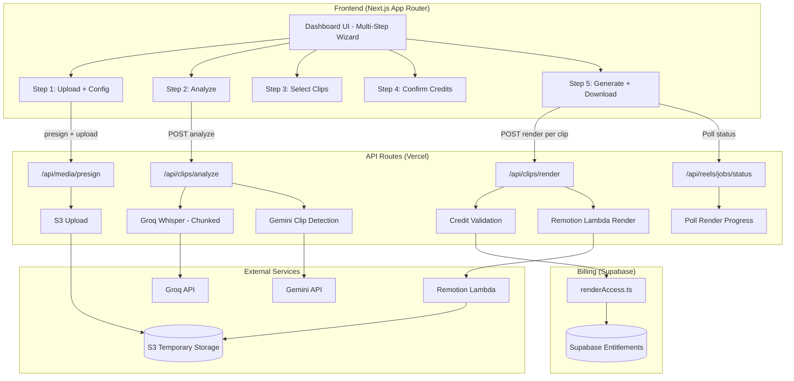
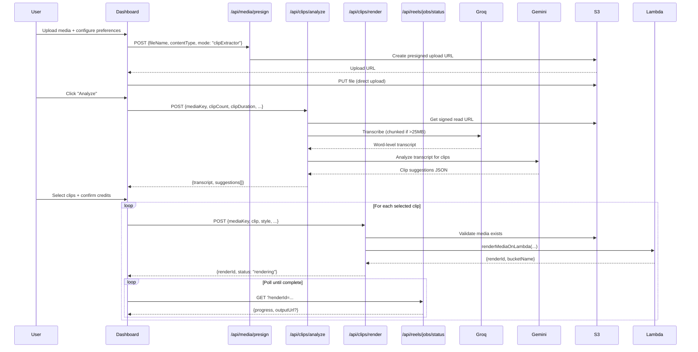

# Design Document: Podcast Clip Extractor

## Overview

The Podcast Clip Extractor is a multi-step workflow template that extends Itnavideo's single-render pipeline into a stateful, multi-clip generation system. Users upload long-form content (2–120 minutes), the system transcribes the full audio via Groq Whisper, Gemini AI analyzes the transcript to suggest clip-worthy segments, and users select which clips to render — each consuming 1 credit independently on Remotion Lambda.

### Key Design Decisions

1. **Separate API routes** — A new `/api/clips/analyze` route handles transcription + Gemini analysis (long-running, no credits consumed). Individual clip renders reuse the existing Lambda render pipeline via `/api/clips/render`.
2. **Client-side session state** — Clip suggestions and selection state live in React state (+ localStorage backup) rather than a database table. This matches the existing dashboard pattern and avoids new DB migrations.
3. **Chunked transcription** — Groq Whisper has a 25MB file size limit. Long audio is split into chunks, transcribed independently, then merged with offset timestamps.
4. **Per-clip credit billing** — Credits are charged at render start (not session start), with automatic refund on failure. This reuses the existing `renderAccess` + `recordRenderUsageFromServer` pattern.
5. **Two Remotion compositions** — `PODCAST-CLIP-VIDEO` (talking-head crop + captions) and `PODCAST-CLIP-AUDIO` (avatar + waveform + captions). Both registered in `remotion/index.tsx`.
6. **Gemini for clip detection** — Uses the same `@google/genai` SDK as the Auto Draw planner. No OpenAI dependency.

### Constraints

- No OpenAI API calls (key is expired/paused)
- Groq Whisper only for transcription (English + Hinglish, Roman script)
- S3 temporary storage with 48h lifecycle
- Lambda render inputs must be HTTPS/signed S3 URLs
- Remotion Composition IDs: `a-z`, `A-Z`, `0-9`, `-` only (no underscores)

## Architecture

### System Architecture Diagram



### Request Flow



## Components and Interfaces

### API Routes

#### 1. `/api/clips/analyze` (POST)

Handles full transcription + AI clip detection. This is the long-running analysis step (no credits consumed).

**Request Body:**
```typescript
{
  mediaKey: string;           // S3 object key from presign upload
  fileName: string;
  contentType: string;        // "video/mp4" | "audio/mp3" etc.
  userId: string;
  clipCount: 3 | 5 | 10;     // Number of suggestions to generate
  clipDuration: 30 | 45 | 60; // Target duration per clip (seconds)
  title?: string;             // Podcast/video title for context
  speakerName?: string;       // Speaker name for prompt context
  style?: ClipStyle;          // Styling preference hint
}
```

**Response Body:**
```typescript
{
  ok: boolean;
  transcript: string;                   // Full transcript text
  words: ReelWord[];                    // Word-level timestamps
  segments: ReelTranscriptSegment[];    // Sentence-level segments
  durationSeconds: number;             // Total source duration
  languageHint: "english" | "hinglish";
  suggestions: ClipSuggestion[];       // AI-generated clip candidates
  analysisSource: "gemini" | "fallback";
}
```

#### 2. `/api/clips/render` (POST)

Renders a single clip. Validates credits, deducts on start, refunds on failure.

**Request Body:**
```typescript
{
  mediaKey: string;           // Original source S3 key
  userId: string;
  clip: {
    startTime: number;        // Seconds
    endTime: number;          // Seconds
    title: string;            // Hook/title overlay text
  };
  sourceType: "video" | "audio";
  style: ClipStyle;
  captionStyle?: string;
  speakerName?: string;
  avatarUrl?: string;         // For audio-only mode
  ctaText?: string;
  podcastTitle?: string;      // For audio-only mode label
}
```

**Response Body:**
```typescript
{
  ok: boolean;
  renderId: string;
  bucketName: string;
  outName: string;
  status: "rendering";
  creditCharged: boolean;
}
```

#### 3. `/api/media/presign` (existing, extended)

Add `clipExtractor` mode recognition. Increase max file size validation to 500MB (already the limit). Duration validation happens client-side and in `/api/clips/analyze`.

### Frontend Components

#### `ClipExtractorWizard` (main page component)

Multi-step wizard managing the 5-step workflow state:

```typescript
type WizardStep = "upload" | "analyze" | "select" | "confirm" | "generate";

type WizardState = {
  step: WizardStep;
  mediaKey: string | null;
  mediaUrl: string | null;
  sourceType: "video" | "audio";
  config: ClipExtractorConfig;
  transcript: FullTranscript | null;
  suggestions: ClipSuggestion[];
  selectedClipIds: Set<string>;
  renderJobs: Map<string, ClipRenderJob>;
};
```

#### Sub-components:
- `ClipUploadStep` — File upload with progress, format/duration validation
- `ClipConfigPanel` — Title, speaker, clip count, duration, style selectors
- `ClipAnalysisStep` — Loading state during transcription + AI analysis
- `ClipSelectionStep` — Scrollable list of suggestions with checkboxes + preview
- `ClipPreviewPanel` — Transcript excerpt, video player at timestamp, AI reason
- `ClipConfirmDialog` — Credit summary + confirm/cancel
- `ClipGenerateStep` — Per-clip progress indicators + download links

### Remotion Compositions

#### `PODCAST_CLIP_VIDEO` (Composition ID: `PODCAST-CLIP-VIDEO`)

Talking-head video clip with vertical crop + captions.

```typescript
type PodcastClipVideoProps = {
  mediaSrc: string;           // Signed S3 URL to source video
  mediaTrimStartSeconds: number;
  durationSeconds: number;
  captions: CaptionSegment[];
  captionStyle: string;
  captionPosition: "bottom" | "center";
  textColor: string;
  highlightColor: string;
  hookTitle: string;          // Title overlay at start
  speakerName?: string;
  ctaText?: string;
  showProgressBar: boolean;
  highlightWords: string[];   // Words to highlight in captions
};
```

Layout: Full-screen video (center-cropped to 9:16) → vignette overlay → word-synced captions → hook title (first 3s) → progress bar (bottom) → optional speaker label → optional CTA (last 3s).

#### `PODCAST_CLIP_AUDIO` (Composition ID: `PODCAST-CLIP-AUDIO`)

Audio-only clip with avatar + waveform + captions.

```typescript
type PodcastClipAudioProps = {
  audioSrc: string;           // Signed S3 URL to source audio
  audioTrimStartSeconds: number;
  durationSeconds: number;
  captions: CaptionSegment[];
  captionStyle: string;
  textColor: string;
  highlightColor: string;
  hookTitle: string;
  avatarSrc?: string;         // Speaker avatar image URL
  speakerName?: string;
  podcastTitle?: string;
  ctaText?: string;
  showProgressBar: boolean;
  highlightWords: string[];
  waveformColor: string;
  backgroundColor: string;
};
```

Layout: Gradient background → centered avatar circle → animated waveform bar below avatar → word-synced captions (center) → podcast title label (top) → hook title (first 3s) → progress bar (bottom) → optional CTA (last 3s).

### Service Layer

#### `services/ai/clipDetector.ts`

Handles Gemini API integration for clip detection:

```typescript
export async function detectClipSegments(input: {
  transcript: string;
  segments: ReelTranscriptSegment[];
  words: ReelWord[];
  clipCount: number;
  clipDuration: number;
  title?: string;
  speakerName?: string;
}): Promise<ClipSuggestion[]>;
```

Uses a structured Gemini prompt that:
1. Receives the full transcript with timestamps
2. Identifies emotional peaks, advice moments, hooks, tips, and complete thoughts
3. Returns exactly `clipCount` suggestions with start/end aligned to sentence boundaries
4. Each suggestion includes title, reason, and duration within ±5s of target

Fallback: If Gemini fails, a local heuristic splits transcript into even segments with keyword scoring.

#### `services/ai/transcriptionChunker.ts`

Handles chunked transcription for long audio:

```typescript
export async function transcribeFullMedia(input: {
  mediaUrl: string;
  fileName: string;
  contentType: string;
}): Promise<{
  transcript: string;
  words: ReelWord[];
  segments: ReelTranscriptSegment[];
  durationSeconds: number;
  languageHint: "english" | "hinglish";
  chunks: number;
}>;
```

Strategy:
1. If file ≤ 25MB → single Groq call (existing pattern)
2. If file > 25MB → download to temp dir → split with ffmpeg into ≤20MB chunks → transcribe each → merge with offset timestamps → cleanup temp files

## Data Models

### Types (shared across frontend + API)

```typescript
// Clip suggestion from Gemini analysis
type ClipSuggestion = {
  id: string;                    // Generated UUID
  startTime: number;             // Seconds from source start
  endTime: number;               // Seconds from source start
  duration: number;              // endTime - startTime
  title: string;                 // Suggested hook/title (2-8 words)
  reason: string;                // Why this segment is clip-worthy
  transcriptExcerpt: string;     // Text content of the segment
  category: ClipCategory;
};

type ClipCategory =
  | "emotional_moment"
  | "clear_advice"
  | "controversial"
  | "useful_tip"
  | "surprising_fact"
  | "strong_hook"
  | "motivational"
  | "complete_thought";

// Clip extraction preferences
type ClipExtractorConfig = {
  title: string;
  speakerName: string;
  clipCount: 3 | 5 | 10;
  clipDuration: 30 | 45 | 60;
  style: ClipStyle;
  ctaText: string;
  avatarUrl?: string;            // Audio-only mode
};

type ClipStyle =
  | "podcast_subtitles"
  | "talking_head"
  | "quote_highlight"
  | "educational"
  | "viral_hook";

// Render job tracking (client-side)
type ClipRenderJob = {
  clipId: string;
  renderId: string | null;
  bucketName: string | null;
  status: "queued" | "rendering" | "complete" | "failed";
  progress: number;              // 0-100
  outputUrl: string | null;
  error: string | null;
  creditCharged: boolean;
  creditRefunded: boolean;
};

// Full transcript result (stored in wizard state)
type FullTranscript = {
  text: string;
  words: ReelWord[];
  segments: ReelTranscriptSegment[];
  durationSeconds: number;
  languageHint: "english" | "hinglish";
  chunks: number;
};
```

### Database Impact

No new Supabase tables required. The system reuses:
- **`render_history`** — Each rendered clip is recorded as an individual render entry (existing table)
- **`app_settings`** — Usage ledger for credit tracking (existing pattern via `renderAccess.ts`)
- **Supabase Auth** — User authentication (existing)
- **Billing entitlements** — Credit balance validation (existing `getBillingEntitlementFromServer`)

Session state (suggestions, selections) lives in React state + localStorage, consistent with the existing dashboard pattern where render state is client-managed.

### S3 Storage Layout

```
uploads/{userId}/{timestamp}-{filename}          → Source media (48h expiry)
renders/{userId}/{timestamp}-{slug}-clip-1.mp4   → Rendered clips (48h expiry)
renders/{userId}/{timestamp}-{slug}-clip-2.mp4
```

No change to existing S3 lifecycle rules.


## Correctness Properties

*A property is a characteristic or behavior that should hold true across all valid executions of a system — essentially, a formal statement about what the system should do. Properties serve as the bridge between human-readable specifications and machine-verifiable correctness guarantees.*

### Property 1: Media format validation

*For any* MIME type string, the media format validator SHALL accept it if and only if it matches one of the allowed formats (video/mp4, video/quicktime, video/webm, audio/mpeg, audio/wav, audio/x-m4a, audio/aac), and SHALL reject all other MIME type strings.

**Validates: Requirements 1.1, 1.2**

### Property 2: Duration range validation

*For any* numeric duration value, the duration validator SHALL accept it if and only if it falls within the range [120, 7200] seconds (2–120 minutes), and SHALL reject values outside this range with the appropriate error type (too-short or too-long).

**Validates: Requirements 1.4, 1.5, 1.6**

### Property 3: Chunked transcription timestamp merging

*For any* sequence of chunked transcription results (each with word-level timestamps starting from 0), merging them with sequential time offsets SHALL produce a combined word array where: timestamps are monotonically non-decreasing, the final word's end time approximates the total source duration, and no two chunks produce overlapping time ranges.

**Validates: Requirements 2.2**

### Property 4: Devanagari script removal

*For any* string containing Devanagari characters (Unicode range U+0900–U+097F), the transcript normalization function SHALL produce output containing zero characters in that Unicode range while preserving all Latin/ASCII content.

**Validates: Requirements 2.5**

### Property 5: Clip count enforcement

*For any* valid clip count request (3, 5, or 10) and any Gemini response containing an arbitrary number of suggestions, the clip suggestion parser SHALL always return exactly the requested count — trimming excess suggestions by quality score, or generating fallback suggestions from transcript segments if the response provides fewer.

**Validates: Requirements 3.3**

### Property 6: Clip suggestion validity

*For any* clip suggestion returned by the analyzer, it SHALL have all required fields populated (id, startTime, endTime, title, reason, transcriptExcerpt, category), AND its duration (endTime − startTime) SHALL be within ±5 seconds of the user-selected clip duration preference.

**Validates: Requirements 3.4, 3.5**

### Property 7: Sentence boundary alignment

*For any* transcript with word-level timestamps and sentence-ending punctuation markers, the clip boundary adjustment function SHALL produce start and end times that align with sentence boundaries — meaning the word at startTime begins a sentence (first word or follows sentence-ending punctuation) and the word at endTime ends a sentence (followed by sentence-ending punctuation or is the final word).

**Validates: Requirements 3.6, 3.7**

### Property 8: Credit summary computation

*For any* set of selected clip IDs (size 1–10) and any credit balance (≥ 0), the credit summary SHALL report: selectedCount equal to the set size, totalCreditsRequired equal to selectedCount × 1, and the generate button SHALL be disabled if and only if totalCreditsRequired exceeds the credit balance.

**Validates: Requirements 4.3, 4.5**

### Property 9: Time-range transcript extraction

*For any* full transcript with word-level timestamps and any clip time range [startTime, endTime], extracting the caption segments for that range SHALL return exactly the words whose timestamps overlap with the range, in their original order, with no words from outside the range included.

**Validates: Requirements 5.4, 6.4, 11.1**

### Property 10: Source type composition routing

*For any* render request, if the sourceType is "audio" the system SHALL route to the `PODCAST-CLIP-AUDIO` composition, and if the sourceType is "video" the system SHALL route to the `PODCAST-CLIP-VIDEO` composition. No other routing is valid.

**Validates: Requirements 6.1**

### Property 11: Wizard step advancement gate

*For any* wizard state with a current step, advancement to the next step SHALL be blocked unless the current step's completion requirements are satisfied: Upload requires mediaKey to be set, Analyze requires suggestions array to be non-empty, Select requires at least one clip selected, Confirm requires explicit user confirmation flag.

**Validates: Requirements 8.3**

### Property 12: Credit refund on render failure

*For any* clip render that transitions to a "failed" status after credits were charged, the system SHALL issue a credit refund of exactly 1 credit, resulting in the user's balance being restored to its pre-render value for that clip.

**Validates: Requirements 9.3**

### Property 13: Batch rendering credit gate

*For any* batch of N selected clips and a starting credit balance B where B < N, the system SHALL render exactly min(B, N) clips, stopping before the (B+1)th clip, and SHALL not attempt to render any clip when the remaining balance is 0.

**Validates: Requirements 9.4, 9.5**

## Error Handling

### Transcription Errors

| Error Scenario | Handling | User Message |
|---|---|---|
| Groq API timeout / 5xx | Retry once with exponential backoff (2s). If still fails, show error. | "Transcription service is temporarily unavailable. Please try again in a moment." |
| Groq API 413 (file too large) | Should not occur with chunking, but if a single chunk > 25MB, re-split. | "Processing your file. This may take a moment for longer content." |
| No speech detected | Return error, do not proceed to analysis. | "No clear speech detected. Please upload content with spoken audio." |
| Chunk merge failure | Log error, attempt single-call transcription as fallback. | "Processing took longer than expected. Retrying..." |

### Gemini Analysis Errors

| Error Scenario | Handling | User Message |
|---|---|---|
| Gemini API timeout / 5xx | Retry once. If fails, fall back to local heuristic clip detection. | Analysis completes with `analysisSource: "fallback"`. No error shown. |
| Gemini returns malformed JSON | Parse what's possible, fill remaining slots with local heuristic. | Silent fallback — user sees suggestions from mixed source. |
| Gemini returns wrong clip count | Trim excess or pad with heuristic suggestions to match requested count. | No error — count is always enforced. |
| Gemini returns out-of-range timestamps | Clamp to [0, sourceDuration]. Adjust to sentence boundaries. | No error — boundaries are always corrected. |

### Render Errors

| Error Scenario | Handling | User Message |
|---|---|---|
| Lambda render failure | Mark clip as "failed", refund 1 credit, continue batch for remaining clips. | "Clip '{title}' failed to render. Credit refunded. [Retry]" |
| Lambda timeout | Same as failure — refund + retry option. | "Clip '{title}' timed out. Credit refunded. [Retry]" |
| S3 media expired (48h) | Detect 403/404 on media URL. Block render, ask user to re-upload. | "Your source file has expired. Please upload again to continue." |
| Mid-batch credit exhaustion | Stop remaining renders. Show partial completion. | "Credits used up. {N} of {M} clips rendered. Upgrade for more." |

### Upload Errors

| Error Scenario | Handling | User Message |
|---|---|---|
| Unsupported format | Reject before upload starts. | "Unsupported format. Please upload MP4, MOV, WEBM, MP3, WAV, M4A, or AAC." |
| Duration < 2 min | Reject after metadata read. | "This file is under 2 minutes. Use our single-render templates for short content." |
| Duration > 120 min | Reject after metadata read. | "Maximum supported duration is 120 minutes. Please trim your file." |
| Upload network failure | Allow retry from same file. Progress resets. | "Upload interrupted. Please try again." |
| File > 500MB | Reject before upload. | "File is too large. Please upload a file under 500MB." |

### Retry Strategy

- **Transcription**: 1 retry with 2s backoff. No automatic retry after that — user clicks retry.
- **Gemini analysis**: 1 retry, then local fallback. Never blocks the workflow.
- **Lambda render**: No automatic retry. User gets explicit "Retry" button per failed clip.
- **S3 presign**: 1 retry. If fails, surface storage error.

## Testing Strategy

### Property-Based Tests (fast-check)

The project will use [fast-check](https://github.com/dubzzz/fast-check) for property-based testing in the TypeScript/Node.js environment. Each property test runs a minimum of 100 iterations.

| Property | Test File | What It Validates |
|---|---|---|
| 1: Media format validation | `__tests__/clips/mediaFormatValidation.property.test.ts` | MIME type accept/reject logic |
| 2: Duration range validation | `__tests__/clips/durationValidation.property.test.ts` | 2–120 min acceptance window |
| 3: Timestamp merging | `__tests__/clips/timestampMerging.property.test.ts` | Monotonic merged timestamps |
| 4: Devanagari removal | `__tests__/clips/devanagariRemoval.property.test.ts` | No Devanagari in output |
| 5: Clip count enforcement | `__tests__/clips/clipCountEnforcement.property.test.ts` | Always returns exact count |
| 6: Clip suggestion validity | `__tests__/clips/clipSuggestionValidity.property.test.ts` | Schema + duration tolerance |
| 7: Sentence boundary alignment | `__tests__/clips/sentenceBoundary.property.test.ts` | Clips start/end at sentences |
| 8: Credit summary computation | `__tests__/clips/creditSummary.property.test.ts` | Count, cost, button state |
| 9: Time-range extraction | `__tests__/clips/timeRangeExtraction.property.test.ts` | Correct words in range |
| 10: Composition routing | `__tests__/clips/compositionRouting.property.test.ts` | Audio → audio comp, video → video comp |
| 11: Wizard advancement gate | `__tests__/clips/wizardAdvancement.property.test.ts` | Step blocking logic |
| 12: Credit refund | `__tests__/clips/creditRefund.property.test.ts` | Refund on failure |
| 13: Batch credit gate | `__tests__/clips/batchCreditGate.property.test.ts` | Stop when credits run out |

**Configuration**: Each property test tagged with:
```typescript
// Feature: podcast-clip-extractor, Property {N}: {title}
```

### Unit Tests (example-based)

| Area | Key Tests |
|---|---|
| Gemini prompt construction | Verify prompt includes all clip categories, title, speaker context |
| Clip suggestion parsing | Parse valid JSON, handle malformed response, fill defaults |
| Render props builder | Verify correct props for video mode vs audio mode |
| Wizard state transitions | Each step's completion conditions |
| UI components | Config form defaults, selection toggle, progress indicators |

### Integration Tests

| Area | Approach |
|---|---|
| Full analyze flow | Mock Groq + Gemini → verify end-to-end response shape |
| Render flow | Mock Lambda → verify credit charge/refund cycle |
| Presign extension | Verify `clipExtractor` mode is recognized |
| History recording | Verify clips appear in render history |

### Smoke Tests

| Check | What |
|---|---|
| Composition metadata | Both compositions return 1080×1920 |
| Default config values | clipCount=5, clipDuration=45 |
| Template registry | Both templates registered in REEL_TEMPLATE_REGISTRY |

