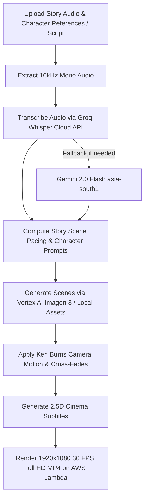

# Image to Video AI (`imagetovideoai.md`)

## 1. Overview & Purpose
**Image to Video AI** is Itnavideo's flagship cinematic narrative & story video creator. Its **primary use case is visual story creation, user narrative storytelling, and cinematic explainers**. It transforms user-uploaded voiceover narration audio, script stories, and character references into a cohesive 16:9 widescreen cinema-grade story video. It incorporates subtle Ken Burns camera motion (pan/zoom), smooth cross-dissolve scene transitions, and timed 2.5D frosted subtitles. (Note: External Pexels API fallback is completely removed; all visuals are generated directly via Vertex AI Imagen 3 / Gemini 2.0 or selected from the curated local Itnavideo library).

---

## 2. Key Specifications & Limits

| Attribute | Specification |
| :--- | :--- |
| **Video Type ID** | `image-to-video` / `IMAGE_TO_VIDEO_AI` |
| **Composition ID** | `IMAGE-TO-VIDEO-AI` |
| **Template Location** | `remotion/templates/IMAGE_TO_VIDEO_AI/template.tsx` |
| **Dashboard Studio** | `components/dashboard/ImageToVideoStudio.tsx` |
| **Dashboard Route** | `/dashboard/image-to-video` |
| **Aspect Ratio** | 16:9 Cinema Widescreen |
| **Resolution & Quality** | **1920×1080 (1080p Full HD)** |
| **Frame Rate** | 30 FPS |
| **Max Audio Duration** | Up to **12 minutes** (720 seconds) |
| **Primary Category** | Cinema, Narrative Stories & Explainers |
| **Credit Cost** | Standard tier credit allocation based on duration |
| **Design System** | Google Analytics Palette (`#070B14`, `#0E1526`, `#FF6D00`, `#FF8F00`) + M3. See [`COLOR_DESIGN_SYSTEM.md`](file:///c:/Users/user/.gemini/antigravity/scratch/itnavideo/COLOR_DESIGN_SYSTEM.md) |
| **Speech Transcription** | Extracted 16kHz audio → Groq Whisper Cloud API (Fallback: Gemini 2.0 Flash `asia-south1`) |
| **Cloud Engine** | AWS Lambda (Remotion in `us-east-1` Mumbai) |

---

## 3. User Inputs & Dashboard Workflow (4 Simple Steps)

1. **Step 1 — Your Audio / Story Narration (Required)**:
   - Upload voiceover narration audio (MP3, WAV, M4A, AAC — 12 min max). Raw video is never sent directly to Groq; lightweight 16kHz mono audio is extracted first.
2. **Step 2 — Your Story Visuals & AI Character Consistency**:
   - **`AI Generated (Consistent Characters)` (Primary for User Stories)**:
     - **Main Character (Required)** + **Character 2 (Optional)** + **Character 3 (Optional)** image reference uploads for character consistency across story scenes.
     - **Hard Constraint Visual Style**: `2D`, `3D`, or `Realistic` enforced strictly across all scenes.
     - **Gemini 2.0 / Vertex AI Scene Planner**: Plans story beats dynamically (~5-6s fast / ~9-10s explanatory) with scene visual prompts.
     - **Vertex AI Imagen 3 Customization Engine**: Generates character-consistent images passing subject/style references.
     - **Direct Timeline Assignment**: Bypasses runtime external image search during rendering; each scene knows its exact generated image URL.
     - **Individual Image Regeneration (`[ 🔄 Regenerate Image ]`)**: Regenerate any specific scene image on demand while preserving style, character references, and script context.
     - **Resilient S3 Media Storage**: Saves generated images asynchronously to AWS S3; if S3 fails, falls back gracefully to Data URLs so render jobs never fail.
   - **`Itnavideo Assets` (Default)**: Match narration to selected 2D, 3D, or Realistic local image library.
   - **`User Uploaded Images`**: Upload custom images/screenshots. Use only these images; do not add stock photos.
   - **`Mix`**: Place uploaded images at key story beats and fill remaining scenes from local Itnavideo style library.
3. **Step 3 — Captions**:
   - 4 featured styles (`Clean Glass`, `Bold Cinema`, `Documentary`, `Kinetic Yellow`) with `View all 10 styles` expansion.
4. **Step 4 — Background Music**:
   - `Auto` (Default recommended), `None`, or `Choose` (expands 6 curated studio tracks + volume slider).
5. **AI Scene Plan & Preview**:
   - Real-time client-side scene timeline mapping narration duration (e.g. `12:04`, `02:30`) to sequential scene cards with thumbnails, timestamps (`00:00–00:18`, `00:18–00:42`), camera motion badges (`🎬 Slow Zoom In`, `✨ Parallax Drift`), and "Looks good → Ready to render" verification.
6. **Unified Fixed Bottom Generate Bar**:
   - Single clean sticky bar showing status (`✓ Audio Ready  ✓ Visuals  12:00 Max  ~X credits`) + `[ Generate Video → ]`.

---

## 4. Dedicated Processing Pipeline (UI Stepper)

> [!IMPORTANT]
> `User Uploaded Images` mode strictly uses user images. External Pexels API dependencies have been completely removed across all modes.



### UI Stepper Stages & Pacing Rules:
Pexels fallback uses the server-only `PEXELS_API_KEY` from `.env.local`; it is capped at 24 missing or weak scene matches per render and never runs in `User Uploaded Images` mode.

1. **Audio & Media Prep**: Validating audio file, extracting 16kHz mono audio, verifying duration (<= 720s).
2. **Transcribe Narration**: Groq Whisper speech-to-text generating word-level timestamps (Fallback: Gemini 2.0 Flash).
3. **5s–7s Dynamic Pacing & Sentence Boundary Alignment**: Grouping narration into ~5.0s–5.5s scenes aligned strictly to sentence/thought boundaries (period, question mark, comma, pause). Scene duration never exceeds 7 seconds!
4. **Semantic Image & Stat Metric Matching**:
   - Matching uploaded/stock image URLs and filenames to transcript keywords.
   - If numbers/statistics are spoken (`80%`, `$10,000`, `2026`, `3.5M`), automatically generating a Kinetic Typography Stat Callout Card unless an exact matching image is available.
   - Fallback to Kinetic Typography Cards if no image matches the spoken context.
5. **Cinematic Parallax & Motion**: Generating smooth camera motion (`zoom-in`, `zoom-out`, `pan-left`, `pan-right`) and cross-dissolves.
6. **Render 16:9 Full HD MP4**: Cloud render via Remotion AWS Lambda (`IMAGE_TO_VIDEO_AI`).

---

## 5. Remotion Composition Props

```typescript
export interface ImageToVideoScene {
  id: string;
  imageUrl: string;
  startFrame: number;
  durationInFrames: number;
  motionType: 'zoom-in' | 'zoom-out' | 'pan-left' | 'pan-right' | 'subtle-drift';
  captionText?: string;
}

export interface ImageToVideoAiProps {
  audioUrl: string;
  totalDurationInFrames: number;
  fps: number;
  scenes: ImageToVideoScene[];
  subtitles?: {
    text: string;
    startFrame: number;
    endFrame: number;
  }[];
  theme?: {
    fontFamily: string;
    primaryColor: string;
    subtitlesEnabled: boolean;
  };
}
```

---

## 6. Visual Design & Motion System
- **Google Analytics Palette**: Deep canvas (`#070B14`, `#0E1526`), warm orange accents (`#FF6D00` to `#FF8F00`) on UI controls and progress meters. See [`COLOR_DESIGN_SYSTEM.md`](file:///c:/Users/user/.gemini/antigravity/scratch/itnavideo/COLOR_DESIGN_SYSTEM.md).
- **Edge-to-Edge 16:9 Cinema & Auto-Cropping**: Default `fitMode: 'cover'` with zero dark borders or letterboxing. When 9:16 vertical images or non-16:9 assets are used, the engine automatically crops them to 16:9 with smart focal positioning (`center 35%` subject bias) so vertical subjects and faces are naturally framed.
- **Ken Burns Motion**:
  - Scale factor: Safe bound scale from `1.06` to `1.18` across scene duration to ensure translation offsets never expose borders.
  - Pan vector: Subtle translation (`0px` to `±24px`) with vertical `pan-up` / `pan-down` and horizontal drift for cinematic motion across cropped visuals.
- **Cross-Fade Transitions**: Smooth opacity and slide-push blending between sequential scenes.

---

## 7. Multimodal Image Understanding & Semantic Script Indexing

> [!CRITICAL]
> **Visual Content Grounding Rule (Founder Directive)**:
> For every uploaded image, the pipeline **analyzes the actual visual content using Multimodal Vision Understanding** (Gemini 2.5/2.0 Flash) and **NEVER relies on the original filename** (e.g. `IMG_1234.png`, `Screenshot (42).jpg`, `temp.png`).
>
> 1. **Visual Content Analysis**:
>    - Extracts visual subjects, foreground/background setting, lighting, actions, and detected objects.
>    - Generates a **meaningful descriptive snake_case filename** (e.g. `software_engineer_coding_three_monitors_dark_room.jpg`, `stock_market_candlestick_growth_chart_green.png`).
>    - Generates a **detailed 2-3 sentence image description** detailing the visible narrative context.
>    - Extracts **15-25 highly relevant keywords, tags, positive themes, and negative themes**.
>    - **Forbidden**: Never assigns random or generic names (`image1.jpg`, `custom_img.png`, `upload.jpg`, `unnamed.png`).
>
> 2. **Script-to-Image Semantic Indexing**:
>    - Only after full visual analysis is the image indexed in memory.
>    - Narration script chunks (5s-7s sentence windows) are semantically matched against each analyzed image's keywords (+12), descriptive filename tokens (+15), positive themes (+14), and detailed description context (+4), while penalizing negative contradictions (-100).
>    - Highest scoring images are assigned to corresponding scene beats.
>
> 3. **Asset Storage & Resilient Fallbacks**:
>    - Production assets are served from AWS S3 (`itnavideo-media-assets`) and Cloudinary (`res.cloudinary.com/dhouh9idx`).
>    - If no image matches a spoken stat/number (`$10,000`, `85%`, `2026`), the pipeline automatically generates a Kinetic Typography Stat Callout Card.
>    - If all user assets are assigned, remaining scenes use curated stock assets or kinetic typography cards.

---

## 8. Dashboard Project History & Download Features
- **Persistent M3 Switcher**: `[ Studio ]` and `[ Your Videos / Projects ]` persistent tabs right on the dashboard.
- **Robust Render Completion Detection**: Polling acknowledges `state === 'ready'`, `state === 'done'`, and `statusPayload.done` flags with presigned MP4 resolution to eliminate stuck progress screens.
- **Real-time Local & Cloud Sync**: Completed renders are saved to browser `localStorage` (`itnavideo_image_to_video_projects`) and synchronized with `/api/reels/history` in Supabase using mode aliases (`imageToVideoAi`, `IMAGE_TO_VIDEO_AI`).
- **Direct 1080p MP4 Download**: Dual download capability: in-browser blob download with active spinner feedback + direct cloud anchor link fallback.
- **48-Hour Retention**: Automated private cloud retention with timestamp indicators.

---

## 9. Edge Cases & Safeguards
- **Mismatched Image Count**: If audio is 60 seconds and only 2 images are provided, scenes automatically divide equally with continuous subtle motion.
- **Silent or Inaudible Audio**: Groq Whisper returns `NO_SPEECH_DETECTED`; dashboard flags clear error before triggering cloud render.
- **Non-16:9 Images**: Default `cover` scaling guarantees zero black bars for YouTube.

---

## 10. M3 Stepper Flow & Animated Step Narration Guide
- **Interactive 4-Step Rail**:
  - `Step 1: Your Audio` (Upload voiceover narration audio MP3, WAV, M4A, AAC — up to 12 minutes).
  - `Step 2: Your Visuals` (Choose visual mode: 2D, 3D, Realistic, User Uploaded Images, or Mix).
  - `Step 3: Subtitles & Captions` (Select from 10+ 2.5D frosted glass cinema subtitle styles).
  - `Step 4: Background Music & 1080p Export` (Curated studio BGM with smart speech ducking, 1-click cloud render).
- **Dynamic Animated Step Guide (`AnimatedStepGuide`)**:
  - Kinetic typewriter component animating instructions in real-time (~15ms per character).
  - Ambient Google Analytics orange aura (`#FF6D00` to `#FF8F00` to `#FFA726`).
  - Active step status badge, step narration, and YouTube retention pro-tip ticker.

---

## 11. Resilient Render Execution Flow
- **Direct Voiceover Pipeline**:
  - Validates user-uploaded narration audio, generates word-level timestamps via Groq Whisper, and matches sequential scene images.
- **Resilient Button States**:
  - The final Generate button retains tactile M3 micro-interactions (`active:scale-95`, hover elevation) and validates inputs with clear inline M3 alert banners instead of silently failing.

---

## 13. Direct Cloud S3 Asset URLs & Strict Visual Category Isolation

> [!CRITICAL]
> **AWS Lambda Cloud Rendering Asset Guarantees**:
> To prevent image load crashes (`Fs is not defined`, 404s, or relative path errors) inside AWS Lambda Chromium instances in `us-east-1`:
>
> 1. **Pure HTTPS S3 Asset URLs**:
>    - All stock assets, unified images, and user-uploaded media are mapped to fully-qualified public HTTPS S3 URLs (`https://remotionlambda-useast1-2zq6twaok1.s3.us-east-1.amazonaws.com/...` or presigned S3 URLs) using `toAbsoluteS3AssetUrl()`.
>    - Relative local paths (`/assets/...`) are **never** passed to Remotion Lambda.
>
> 2. **Strict Category Isolation (`2D` / `3D` / `Realistic`)**:
>    - Visual style selections (`2d`, `3d`, `realistic`) strictly enforce visual category boundaries.
>    - When the user selects `2D`, only 2D digital illustrations and anime assets are used. Realistic photographic stock images are strictly blocked from 2D renders.
>
> 3. **Pre-Render Asset Validation**:
>    - Before initiating cloud render jobs, every `scene.imageUrl` is validated and resolved to an active, accessible HTTPS S3 URL or Cloudinary CDN fallback.


