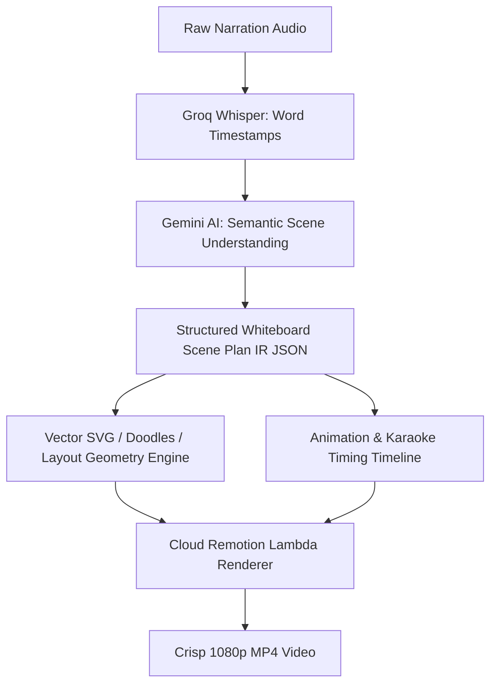

# Whiteboard Animation Video (`whiteboardvideo.md`)

## 1. Overview & Purpose
**Whiteboard Animation Video** brings the clarity of executive boardroom presentations, consulting diagrams, and educational hand-drawn explainers to automated video generation. Rather than childish cartoon doodles, Itnavideo's whiteboard engine emulates a clean corporate strategy whiteboard: thin metal borders, crisp handwriting typography, structured bullet hierarchies, hand-drawn vector arrows, and highlight strokes.

---

## 2. Key Specifications & Limits

| Attribute | Specification |
| :--- | :--- |
| **Video Type ID** | `whiteboard-video` / `WHITEBOARD_VIDEO` |
| **Composition ID** | `WHITEBOARD_VIDEO` |
| **Template Location** | `remotion/templates/WHITEBOARD_VIDEO/template.tsx` |
| **Dashboard Studio** | `components/dashboard/WhiteboardStudio.tsx` |
| **Dashboard Route** | `/dashboard/whiteboard-video` |
| **Aspect Ratio** | 9:16 Vertical (Strictly 9:16) |
| **Resolution & Quality** | **1080×1920 (1080p Full HD)** |
| **Frame Rate** | 30 FPS |
| **Max Video Duration** | **3 Minutes (180s)** |
| **Primary Category** | Explainer & Shorts/Reels |
| **Credit Cost** | 1 credit per render |
| **Transcription Engine**| Extracted 16kHz audio → Groq Whisper Cloud API (Fallback: Google Gemini 2.0 Flash `asia-south1`) |

---

## 3. User Inputs & Smart AI Whiteboard Styling

1. **Narration Audio Track (Required)**:
   - Explainer voiceover, business pitch, or tutorial audio track (MP3/WAV/M4A up to 3 minutes).
2. **Pre-Render Transcript Review & Edit (New)**:
   - Audio is transcribed in 2 seconds via Groq Whisper Cloud.
   - User can review and edit text, spelling, proper nouns, and numbers before rendering.
   - AI uses the user's verified transcript for scene planning and diagram layout.
3. **Fixed Corporate Whiteboard Canvas (Default)**:
   - High-end boardroom eggshell whiteboard with brushed titanium border. Zero decision fatigue for users.
4. **Writing Typography Personalities**:
   - `Marker` (✍️ Natural handwritten look — Default)
   - `Clean` (📋 Professional whiteboard)
   - `Bold` (📢 High-impact presentation)
   - `Blueprint` (📐 Technical drafting style)
5. **Script-Driven Dynamic Drawing & Text System (Zero Static Images)**:
   - **No Static/Cutout Images**: Replaced with 100% dynamic, progressive **SVG Vector Stroke Drawings** that draw in real time alongside handwritten text.
   - **Script Semantics Matching**: Drawings and handwritten text are selected automatically based on narration topic:
     - 🩺 **Medical & Health**: Doctor character, ECG heart rhythm (`medical_ecg_pulse`), pill capsule (`medical_pill_capsule`), DNA helix (`medical_dna_helix`).
     - 📈 **Corporate & Business**: Executive leader, rising bar chart (`business_growth_chart`), target bullseye (`business_target_bullseye`), partnership handshake (`business_handshake`).
     - 🔬 **Science & Education**: Atom orbits (`science_atom_orbit`), chemistry flask (`science_beaker_flask`), lightbulb concept (`science_lightbulb_idea`).
     - 🔄 **Process & Steps**: Curved step connector arrows (`process_step_curved_arrow`), conversion funnel (`process_funnel_filter`).
     - ⚖️ **Comparison (Problem vs Solution)**: Mistake cross (`comparison_cross_error`) vs success checkmark (`comparison_checkmark_success`).
     - 👤 **Story Characters**: Doctor, business executive, thinking/questioning person, victory celebration.
6. **AI Semantic Content Taxonomy (Automatic Layout Mapping)**:
   The Gemini Scene Planner automatically classifies speech beats into optimal visual layouts:
   - 📌 **Core Insight / Paragraph**: Punchy key statement + focal vector sketch.
   - 📋 **Checklist / Bullet Points**: Structured checked/numbered items with progressive marker reveals.
   - 🔢 **Steps / Framework**: `Step 01: IDEA 💡` ➔ `Step 02: VALIDATE ✓` ➔ `Step 03: BUILD 🚀`.
   - ⚖️ **Comparison**: `OLD ❌ vs NEW ✓` contrast cards with real-time vector markers.
   - 📊 **Statistic / Metric**: Bold high-impact number callout (`40% SURGE 📈`) with growth chart sketch.
   - 🔄 **Process / Pipeline**: Step-by-step vector arrows (`INPUT ➔ PROCESS ➔ RESULT`).
   - 📖 **Definition**: `TERM ↓ 3-word meaning` with focus underline.
   - ❓ **Question / Hook**: Big focal question with timed answer reveal.
   - 💡 **Story / Example**: Highlighted keywords with contextual character illustration.
7. **Subtle Marker & Drawing Sound Design (SFX)**:
   - ✍️ **Pen / Marker Sketching Sound** (volume: 30%) automatically synchronized during line reveals.
   - 🖊️ **Marker Cap Soft Click** (volume: 25%) on initial board introduction.
   - 💨 **Board Swipe / Paper Whoosh** (volume: 35%) on multi-board transitions.
8. **Multi-Board Auto-Erase & Pagination (Up to 3 Minutes / 180s)**:
   - Maximum 3–4 points per board to preserve 9:16 vertical canvas readability.
   - Longer videos (30s–180s) automatically distribute points across Board 1 ➔ Board 2 ➔ Board 3 ➔ Board 4 ➔ Board 5.
   - Smooth animated horizontal duster wipe sheen and swipe audio effect on board transitions.

---

## 4. Decoupled Intermediate Representation (IR) Architecture

> [!IMPORTANT]
> **Decoupled AI Thinking & Render Engine**:
> AI (Gemini / Whisper) never renders pixels directly. Instead, it generates a clean, structured **Whiteboard Scene Plan IR (Intermediate Representation JSON)**. The Remotion renderer on AWS Lambda strictly consumes this Scene Plan JSON.
> This ensures:
> 1. Complete separation of AI logic from video rendering.
> 2. Swappable renderer engine without modifying AI planning models.
> 3. 100% deterministic, testable, and inspectable scene graphs.



### UI Stepper Stages:
1. **Transcribing Audio**: Groq Whisper extracting word timestamps & speech pacing.
2. **Understanding Content**: AI analyzing semantics to detect steps, stats, comparisons & key takeaways.
3. **Planning Visual Scenes**: Gemini AI generating the structured Intermediate Scene Plan JSON.
4. **Syncing Vector Drawings**: Synchronizing progressive line reveals & karaoke highlighting with narration.
5. **Rendering 1080p Video**: Cloud Remotion Lambda exporting crisp 1080×1920 Full HD MP4.

---

## 5. Remotion Composition Props

```typescript
export type WhiteboardPoint = {
  text: string;
  title?: string;
  startTime: number;      // When vector card/line starts drawing (seconds)
  endTime: number;        // When vector card finishes drawing (seconds)
  focusStartTime: number; // Spoken speech window start (yellow highlighter box)
  focusEndTime: number;   // Spoken speech window end
  markerColor: string;    // Navy (#1E3A8A), Crimson (#B91C1C), Teal (#0F766E), Amber (#D97706)
  bulletType: 'number' | 'bullet' | 'check' | 'arrow' | 'star';
  isHighlight?: boolean;
  icon?: string;          // Cloudinary doodle icon name (brain, rocket, lightbulb, target, chart, etc.)
  iconUrl?: string;       // Direct CDN URL
  boardIndex: number;     // Multi-board pagination index: 0, 1, 2, 3, 4
  focusType: 'circle' | 'underline' | 'box' | 'arrow' | 'highlight';
};

export type WhiteboardPlan = {
  title: string;
  titleColor: string;
  layoutType: 'cards' | 'table' | 'quiz' | 'hook';
  language: 'ur' | 'hi' | 'en';
  direction: 'rtl' | 'ltr';
  points: WhiteboardPoint[];
  conclusion: string;
  conclusionTime: number;
  source: 'gemini' | 'deterministic';
};

export interface WhiteboardVideoProps {
  mediaSrc: string;
  mediaType: 'audio' | 'video';
  durationSeconds: number;
  title: string;
  titleColor?: string;
  layoutType?: 'cards' | 'table' | 'quiz' | 'hook';
  points: WhiteboardPoint[];
  conclusion?: string;
  conclusionTime?: number;
  boardStyle?: string;
}
```

---

## 6. Drawing & Hand-Sketch Motion Rules
- **Progressive Stroke Reveal**: SVG paths and vector lines use frame interpolation to simulate rapid executive sketching without clumsy bitmap human hands.
- **Board Auto-Erase Wipe Transition**: When moving across boards (`boardIndex: 0 ➔ 1 ➔ 2`), an animated horizontal duster sheen wipes the canvas clean with an accompanying swipe whoosh SFX.
- **Anti-Cramping Policy**: Maximum 3–4 punchy bullet points per board to ensure crystal-clear 9:16 vertical smartphone readability.

---

## 7. Edge Cases & Safeguards
- **Long Audio (Up to 3 Minutes / 180s / 5,400 Frames)**: Automatically distributed across up to 5 clean board pages by `LAYOUT_AUTO_FIXER`.
- **Pre-Render Transcript Editing**: User can verify and fix any typos before submission to guarantee zero misspellings on the board.
- **Deterministic Offline Fallback**: If Gemini AI experiences rate limits, the deterministic planner extracts key points and calculates timestamped boards instantly.
