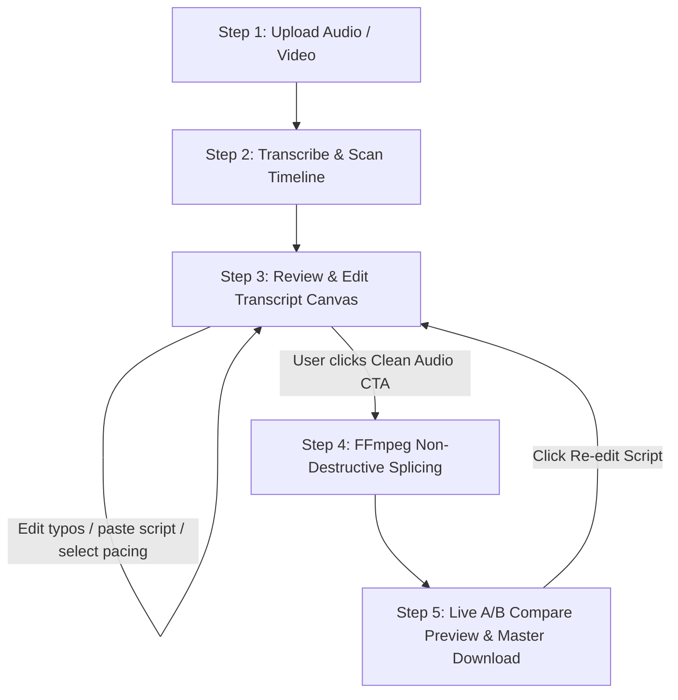

# AI Audio Cleaner & Smart Silence Remover (`audiocleaner.md`)

## 1. Overview & Purpose
**AI Audio Cleaner** is Itnavideo's precise voiceover timing and silence removal engine designed to automatically detect and compress dead air, awkward pauses, and silent intervals across the entire audio timeline while preserving **100% of the original speaker's voice, tone, pitch, accent, and recording character**.

The dedicated studio dashboard (`/dashboard/audio-cleaner`) follows an executive **5-Stage Sequential Pipeline**:
- **Stage 1: Upload Audio / Video**: Accepts voiceover tracks (`MP3`, `WAV`, `M4A`, `AAC`) as well as videos (`MP4`, `MOV` with automatic 16kHz audio extraction).
- **Stage 2: Transcribe Speech & Scan Pauses**: Cloud-based millisecond-accurate speech transcription and word-level timing extraction via Groq Whisper (with automatic fallback to Google Gemini 2.0 Flash `asia-south1`).
- **Stage 3: Review & Edit Transcript (Core Review Canvas — Always Open First)**:
  - Displays the **complete transcript first** before triggering any audio processing.
  - Allows creators to read generated dialogue, fix proper nouns/brand names, format headings (`# Section`), or paste an exact pre-written script.
  - **Pacing Selector**: Fast Retention (calibrated for **Image to Video AI**), Natural Conversational, or Relaxed Flow.
  - **Timeline Pause Inspector**: Visual list of every detected gap with start/end timestamps and targeted cut duration.
  - **Single-Click Action**: Prominent `[ Clean Audio & Remove Silences (N Gaps) ]` CTA. The final audio download is **intentionally NOT shown** here.
- **Stage 4: Clean Audio (Non-Destructive Splice)**: Performs sample-accurate FFmpeg `atrim` + `concat` slicing with 8ms anti-pop micro cross-fades on the source audio stream.
- **Stage 5: Preview & Download**: Live **A/B Comparison Switcher** (`🔴 Before (Original)` vs `✨ After (Cleaned)`), time-saved audit metrics, direct 320kbps MP3 / WAV / M4A downloads, and a `Re-edit Script` button to adjust and re-clean.

---

## 2. Key Specifications & Limits

| Attribute | Specification |
| :--- | :--- |
| **Video Type ID** | `audio-cleaner` / `AI_AUDIO_CLEANER` |
| **Composition ID** | N/A (Cloud Audio Processing & Live A/B Comparison Player) |
| **Dashboard Studio** | `components/dashboard/AudioCleanStudio.tsx` |
| **Dashboard Route** | `/dashboard/audio-cleaner` |
| **Workflow Stages** | `Upload → Transcribe → Review/Edit Transcript → Clean Audio → Preview/Download` |
| **Output Formats** | High-Quality 320kbps MP3 (Default), Lossless WAV, M4A |
| **Input Support** | Audio (`MP3`, `WAV`, `M4A`, `AAC`) & Video (`MP4`, `MOV` - auto audio extraction) |
| **Max Audio Duration** | Up to **12 minutes** (720 seconds) natively |
| **Primary Category** | Audio & Utilities |
| **Credit Cost** | 1 credit per render |
| **Design System** | Google Analytics Palette (`#070B14`, `#0E1526`, `#FF6D00`, `#FF8F00`) + Material Design 3 |
| **Transcription Engine**| Extracted 16kHz audio → Groq Whisper Cloud API (Fallback: Google Gemini 2.0 Flash `asia-south1`) |

---

## 3. 5-Stage Sequential User Workflow



### Stage 1: Upload Audio or Video
- Drag & drop or browse any audio or video file up to 12 minutes.
- Auto-extracts lightweight 16kHz mono audio for ultra-fast cloud processing.
- Presigned upload URL ensures reliable transfers without payload size bottlenecks.

### Stage 2: Transcribe & Scan Timeline
- Groq Whisper Cloud API analyzes spoken words and attaches millisecond-accurate start/end timestamps to each word.
- Fallback to Gemini 2.0 Flash (`asia-south1`) ensures zero downtime if Groq rate limits are encountered.
- Scans all adjacent word pairs across the entire timeline to construct the complete pause registry.

### Stage 3: Review & Edit Transcript (The Review Canvas)
- **Full Script Visibility**: The entire transcript is shown in a structured, syntax-highlighted Markdown editor.
- **Mistake Correction**: Fix mistranscribed names, technical jargon, or brand terms before cutting audio.
- **Paste Mode**: Paste your original production script to cross-align sentence boundaries.
- **Pacing Control**: Choose between Fast (Image to Video), Natural, or Relaxed pacing.
- **No Early Download**: Keeps the user focused on verifying transcript quality before generating the final master.

### Stage 4: Clean Audio
- Backend computes sample-accurate cut timestamps based on chosen pacing rules.
- Executes FFmpeg `atrim` + `concat` with 8ms anti-pop cross-fades (`afade=t=in:d=0.008,afade=t=out:d=0.008`).
- Returns master cleaned audio buffer with verified duration and cut analytics.

### Stage 5: Preview & Download
- **Dual Side-by-Side Audio Players**: Dedicated players for both **🔴 Before (Original Recording with Dead Air)** and **✨ After (Cleaned Studio Master with Preserved Voice)**. Each player includes independent play/pause buttons, interactive timeline scrubbers, animated equalizer frequency bars, and elapsed/total duration counters.
- **Instant A/B Audio Switcher**: 1-click seamless transfer between original and cleaned tracks at corresponding playback percentages to audition silence cuts back-to-back.
- **Time Saved Badge**: Shows exact seconds trimmed and percentage retention boost.
- **Multi-Format Export**: Download 320kbps MP3 (recommended for video editors), Lossless WAV, or M4A.
- **Post-Download & Seamless Reset Workflow**: Prominent **"Upload & Clean Another Audio"** (`+ Clean Another Audio`) CTA enables creators to instantly start their next audio file without refreshing or reloading the browser.
- **Re-edit Loop**: One-click `Re-edit Script` button returns directly to Stage 3 for further fine-tuning.

---

## 4. Smart Pause Removal & Image-to-Video Pacing Engine

### A. Full-Timeline Silence & Gap Detection
Unlike legacy implementations that stopped after 2–3 gaps, the detection engine evaluates **every single spoken interval** across the full audio timeline:
$$\text{Timeline} = \text{Lead-In} \to \text{Word}_1 \to \text{Pause}_1 \to \text{Word}_2 \to \dots \to \text{Word}_N \to \text{Tail}$$

1. **Lead-In Silence**: Trims initial dead air before $\text{Word}_1$, leaving a crisp $0.06\text{s}$ pre-roll buffer.
2. **Intermediate Pauses**: Evaluates gap duration $G = t_{\text{next.start}} - t_{\text{cur.end}}$. If $G > \text{minThreshold}$, calculates non-destructive cut boundaries:
   $$\text{cutStart} = t_{\text{cur.end}} + \text{padding}$$
   $$\text{cutEnd} = t_{\text{next.start}} - \text{padding}$$
   $$\text{remainingPause} = 2 \times \text{padding} = \text{targetRemaining}$$
3. **Tail Silence**: Trims trailing silence after $\text{Word}_N$, leaving a smooth $0.10\text{s}$ post-roll buffer.

### B. Pacing Presets (Image-to-Video Calibration)

| Pacing Mode | Trigger Threshold | Target Remaining Pause | Post/Pre Padding | Best For |
| :--- | :---: | :---: | :---: | :--- |
| **Fast Retention** *(Default)* | $> 0.40\text{s}$ | **$\sim 0.28\text{s}$** | $0.14\text{s}$ each | **Image to Video AI**, TikTok, Reels, Shorts (prevents boring visual dead time during 5–6s image changes) |
| **Natural Conversational** | $> 0.50\text{s}$ | **$\sim 0.35\text{s}$** | $0.175\text{s}$ each | Podcasts, educational explainers, corporate briefings |
| **Relaxed Flow** | $> 0.65\text{s}$ | **$\sim 0.45\text{s}$** | $0.225\text{s}$ each | Cinematic narrations, storytelling, dramatic reading |

### C. Natural Speech Rules
- **Short natural breathing pauses ($< 0.40\text{s}$)**: Kept 100% intact to preserve human vocal rhythm.
- **Long dead air gaps ($> 1.0\text{s}$)**: Aggressively compressed down to the target remaining pause so narration stays punchy.
- **Anti-Robotic Guarantee**: Words are **never glued together** with zero spacing. Natural attack and release envelopes are strictly maintained.

---

## 5. 100% Exact Original Voice Preservation

> [!IMPORTANT]
> **ZERO REGENERATION MANDATE**: The output audio is guaranteed to use the **exact original recorded audio samples** from the user's file.

### Architectural Guarantees:
- ❌ **NO AI Voice Synthesis / Regeneration**: Voice is never passed through a TTS model or voice cloner.
- ❌ **NO Pitch Shifting or Timbre Modification**: Original vocal harmonics and resonance are untouched.
- ❌ **NO Destructive EQ / Loudnorm Filtering**: No artificial frequency boosts, robotic phase artifacts, or muffled FFT filters.
- ✅ **Lossless Audio Splicing**: Slicing is performed directly on the audio stream using FFmpeg `atrim` + `concat`.
- ✅ **8ms Sub-Audible Anti-Pop Fades**: Applied at segment boundaries (`afade=t=in:d=0.008,afade=t=out:d=0.008`) to eliminate DC offset clicks without cutting spoken consonants.

---

## 6. Dedicated Processing Pipeline & Status Mapping

```
Job Initialized ──► Transcribing Audio ──► Review Canvas Ready ──► Splice & Concat ──► Master Ready
  (File Probe)      (Groq Whisper)         (User Edits Script)     (FFmpeg Engine)      (A/B Player)
```

### UI Stepper Stage Definitions:
1. **Audio Prep & Duration Probe**: Probing media container, extracting 16kHz mono audio stream, and verifying duration ($\le 720\text{s}$).
2. **Groq Whisper Transcription**: Cloud-based millisecond-accurate word timestamp extraction.
3. **Smart Pause Audit**: Computing all timeline pauses and displaying the interactive review canvas.
4. **Sample-Accurate Splicing**: Executing non-destructive FFmpeg pause cuts with 8ms anti-pop cross-fades.
5. **Master Render Complete**: Streaming live A/B compare player and high-bitrate download links.

---

## 7. API Architecture & Routes

### A. Analyze Endpoint (`POST /api/audio-clean/analyze`)
- **Inputs**: `fileUrl` (presigned cloud storage link), `pacing` (`fast` | `natural` | `relaxed`), optional `customScript`.
- **Operations**:
  1. Downloads lightweight audio stream.
  2. Runs Groq Whisper transcription (with fallback to Gemini 2.0 Flash).
  3. Executes `detectSmartPauses` across the entire timeline.
  4. Generates clean Markdown script.
- **Response**:
  ```json
  {
    "stats": {
      "originalDuration": 45.2,
      "estimatedDuration": 38.6,
      "estimatedTimeSaved": 6.6,
      "silenceCount": 14,
      "wordCount": 128
    },
    "detectedPauses": [
      { "id": "p-0", "gapDuration": 1.45, "cutStart": 4.22, "cutEnd": 5.39, "cutDuration": 1.17, "description": "Long pause between 'video' and 'Next'" }
    ],
    "markdown": "# Script Review\n...",
    "rawTranscript": "..."
  }
  ```

### B. Clean Audio Endpoint (`POST /api/audio-clean`)
- **Inputs**: `fileUrl`, `pacing`, optional `customSegmentsToCut` (edited by user or computed from script).
- **Operations**:
  1. Computes keep segments: $[0, \text{cut}_1.\text{start}], [\text{cut}_1.\text{end}, \text{cut}_2.\text{start}], \dots, [\text{cut}_N.\text{end}, \text{duration}]$.
  2. Builds FFmpeg filter graph with `atrim` and `concat`.
  3. Exports 320kbps MP3 / WAV.
- **Response**:
  ```json
  {
    "success": true,
    "cleanedAudioUrl": "https://...",
    "originalAudioUrl": "https://...",
    "stats": {
      "originalDuration": 45.2,
      "cleanedDuration": 38.58,
      "timeSaved": 6.62,
      "cutsApplied": 14
    }
  }
  ```

---

## 8. Removed Legacy Capabilities (Strict Policy)
The following legacy modules are permanently removed to keep the tool lightning-fast, predictable, and 100% faithful to the original voice:
- ❌ Destructive noise suppression (`afftdn` / FFT gating)
- ❌ De-reverberation / Echo cancellation filters
- ❌ Vocal tone coloring presets (Warmth, Clarity, Podcast EQ)
- ❌ Broadcast loudness tampering (`loudnorm` -14 LUFS)
- ❌ Fake English sentence fallback
- ❌ Document-mode block sentence tagging tabs
