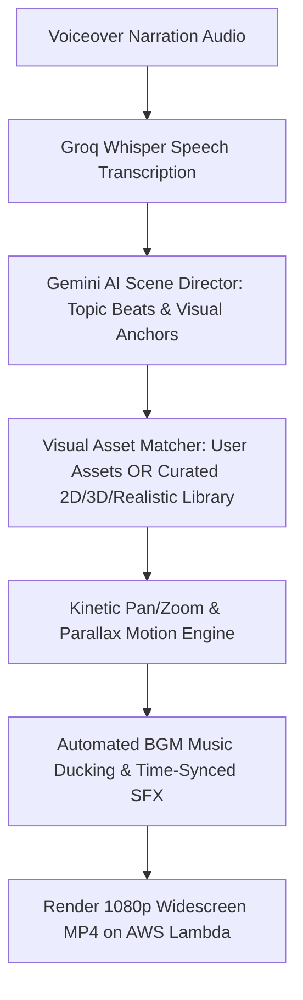

# Faceless Video Generator (`facelessvideo.md`)

## 1. Overview & Purpose
**Faceless Video Generator** powers automated YouTube Cash Cow channels, storytelling accounts, and educational video niches. It turns voiceover audio narration (up to 12 minutes) into a complete 16:9 Full HD video complete with AI visual matching, Canva studio backgrounds, kinetic pan/zoom motion, background music auto-ducking, beat-matched sound effects, and word-synced subtitles.

---

## 2. Key Specifications & Limits

| Attribute | Specification |
| :--- | :--- |
| **Video Type ID** | `faceless-video` / `FACELESS_VIDEO` |
| **Composition ID** | `FACELESS_VIDEO` |
| **Template Location** | `remotion/templates/FACELESS_VIDEO/template.tsx` |
| **Dashboard Studio** | `components/dashboard/FacelessVideoStudio.tsx` |
| **Dashboard Route** | `/dashboard/faceless-video` |
| **Aspect Ratio** | 16:9 Widescreen Full HD |
| **Resolution & Quality** | **1080p Full HD (1920×1080 30 FPS MP4)** |
| **Max Audio Duration** | **12 Minutes (720s)** |
| **Primary Category** | Social & YouTube |
| **Credit Cost** | 2 Credits / Min |
| **Transcription Engine**| Extracted 16kHz audio → Groq Whisper Cloud API (Fallback: Google Gemini 2.0 Flash `asia-south1`) |

---

## 3. Simplified 5-Step Creator Dashboard Flow

The Faceless Video Studio implements a clean, icon-driven 5-step interface:

1. **1. Your Narration (Required)**:
   - 🎙️ Upload audio narration track (MP3, WAV, M4A up to 12 minutes).
2. **2. Image Source**:
  - Choose `Itnavideo Assets`, `User Uploaded Images`, or `Mix`.
  - Choose `Realistic`, `3D`, or `2D` images when Itnavideo Assets or Mix is selected.
  - `User Uploaded Images` uses only uploads. `Mix` places uploads at selected beats and fills remaining scenes from Itnavideo Assets.
  - Pexels is searched only for scenes without a suitable local image, and is never used in uploaded-only mode.
  - 📝 `Video Topic — Optional` field for contextual AI storytelling direction.
3. **3. Video Settings**:
   - **Visual Art Style**:
     - 📸 **Realistic Photo**: Real stock & photography
     - 🧊 **3D Render**: 3D Isometric & depth renders
     - 🎨 **2D Vector**: Clean vector illustrations & digital art
   - **Video Pacing Style**:
     - ✨ **Clean**: Minimal & modern
     - 🎬 **Cinematic**: Dramatic & editorial
     - 📜 **Documentary**: Storytelling style
     - ⚡ **Dynamic**: Fast-paced kinetic
4. **4. Audio**:
   - 🎵 **Background Music**: `ON/OFF` switch (*Music: Auto-Ducking*)
   - 🔊 **Sound Effects**: `ON/OFF` switch (*SFX: Auto-Timed*)
5. **5. AI Visuals & Generation**:
   - ✨ Summary card explaining automated visual, icon, and typography composition.
   - 🚀 **Generate Faceless Video** primary CTA with credit & processing time estimate.

---

## 4. Reusable Asset Storage & Catalog

| Asset Category | Local Path | Production Storage | Catalog Indexing |
| :--- | :--- | :--- | :--- |
| **2D Vector Images** | `public/assets/reusable/images/2d/` | AWS S3 / Cloudinary | Indexed via `npm run assets:index` |
| **3D Render Images** | `public/assets/reusable/images/3d/` | AWS S3 / Cloudinary | Indexed via `npm run assets:index` |
| **Realistic Photos** | `public/assets/reusable/images/realistic/` | AWS S3 / Cloudinary | Indexed via `npm run assets:index` |
| **Sound Effects (SFX)** | `public/assets/reusable/sfx/` | AWS S3 / Cloudinary | Indexed via `npm run assets:index` |
| **Studio Backgrounds** | `public/assets/reusable/backgrounds/` | AWS S3 / Cloudinary | Indexed via `npm run assets:index` |

---

## 5. Automated AI Backend Pipeline



  Pexels fallback uses the server-only `PEXELS_API_KEY` from `.env.local` (documented as an empty entry in `.env.example`). Searches are limited to 24 missing scenes per render and disabled in `User Uploaded Images` mode.

---

## 6. Remotion Composition Props

```typescript
export interface FacelessScene {
  id: string;
  startFrame: number;
  durationInFrames: number;
  videoUrl?: string;
  imageUrl?: string;
  visualArtStyle?: 'realistic' | '3d' | '2d';
  fallbackType?: 'typography' | 'gradient' | 'zoom-still';
  zoomMotion?: 'in' | 'out' | 'pan';
}

export interface FacelessVideoProps {
  audioUrl: string;
  musicUrl?: string;
  musicVolume?: number; // default 0.15
  enableSfx?: boolean;
  scenes: FacelessScene[];
  aspectRatio: '16:9';
  totalDurationInFrames: number;
  fps: number;
  subtitles?: {
    text: string;
    startFrame: number;
    endFrame: number;
  }[];
}
```
