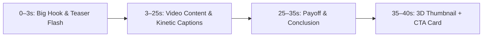

# Long Video Promo / Teaser (`longvideopromo.md`)

## 1. Overview & Purpose
**Long Video Promo / Teaser** turns your long-form video into a high-impact 9:16 vertical promo short. Instead of forcing users to manually edit or crop clips, AI automatically transcribes the audio, detects the strongest viral hook moment (15–45s), generates kinetic word-synced captions, and formats a high-conversion vertical composition with thumbnail reveal and tailored CTA.

---

## 2. Key Specifications & Limits

| Attribute | Specification |
| :--- | :--- |
| **Video Type ID** | `long-video-promo` / `LONG_VIDEO_PROMO` |
| **Dashboard Mode** | `longVideoPromo` |
| **Composition ID** | `LONG_VIDEO_PROMO` |
| **Template Location** | `remotion/templates/LONG_VIDEO_PROMO/template.tsx` |
| **Dashboard Studio** | `components/dashboard/LongVideoPromoStudio.tsx` |
| **Dashboard Route** | `/dashboard/long-video-promo` |
| **Aspect Ratio** | 9:16 Vertical (1080×1920) |
| **Resolution & Quality** | **1080×1920 (1080p Full HD, 30 FPS)** |
| **Max Video Input** | Up to **3 Minutes (180 seconds)** |
| **Primary Category** | Cinema & Long Form |
| **Credit Cost** | 1 credit per render |
| **AI Intelligence** | Groq Whisper speech transcription + viral hook detection + dynamic goal-driven CTA |

---

## 3. Simplified 4-Step Studio Flow

1. **01 — Upload Your Video**:
   - Drag & drop video up to 3 minutes (MP4, MOV, WEBM).
   - AI automatically detects and extracts the best 15–45 second hook.
2. **02 — Add Video Details**:
   - **Thumbnail**: 16:9 YouTube thumbnail image (optional: AI auto-extracts from video frame if omitted).
   - **Video Title**: Long video title for teaser banner and payoff card.
   - **Creator Handle**: Optional `@yourchannel` handle for verified channel badge.
3. **03 — Choose Your Goal**:
   - 🎬 **Watch Full Video** (`WATCH FULL VIDEO · Link in bio & comments`)
   - 🔔 **Get More Subscribers** (`SUBSCRIBE FOR MORE · YouTube Channel`)
   - 🎙️ **Promote Episode** (`WATCH FULL EPISODE · Out now on YouTube`)
4. **04 — AI Promo**:
   - Single-click generation button: `✨ Generate AI Promo (1 Credit)`.
   - Real-time animated processing checklist showing live AI progress.

---

## 4. Narrative Structure & Timeline



1. **0–3 sec (Teaser Intro)**: Quick thumbnail flash + high-impact bold hook text.
2. **3–25 sec (Main Video + Captions)**: Main video playback with live audio spectrum and word-synced subtitles.
3. **25–35 sec (Payoff)**: Interesting conclusion segment.
4. **35–40 sec (Outro Card)**: 3D floating thumbnail + video title + verified creator badge + goal-tailored CTA button.

---

## 5. Remotion Composition Props

```typescript
export interface LongVideoPromoProps {
  mediaSrc: string;
  thumbnailSrc?: string;
  topicTitle?: string;
  title?: string;
  promoGoal?: 'watch-full-video' | 'subscribers' | 'promote-episode';
  promoCreatorHandle?: string;
  ctaText?: string;
  ctaSubtext?: string;
  promoCtaStyle?: 'youtube-red' | 'emerald' | 'glass' | 'tiktok-yellow';
  promoBackgroundMode?: 'blur' | 'solid';
  captions?: Array<{
    text: string;
    start: number;
    end: number;
  }>;
  durationSeconds?: number;
}
```

---

## 6. Visual Design System Compliance
- **Design Tokens**: Google Analytics Orange (`#FF6D00`, `#FF8F00`, `#FFA726`).
- **Surface**: Obsidian Dark Surface Container (`bg-white/[0.04] backdrop-blur-2xl border-white/15 ring-1 ring-white/10`).
- **M3 Shapes**: `rounded-[28px]` containers, `rounded-2xl` inputs/cards, `rounded-full` buttons.
- **Player Preview**: Live 9:16 interactive player with live captions and bottom AI Intelligence Insight Card.
