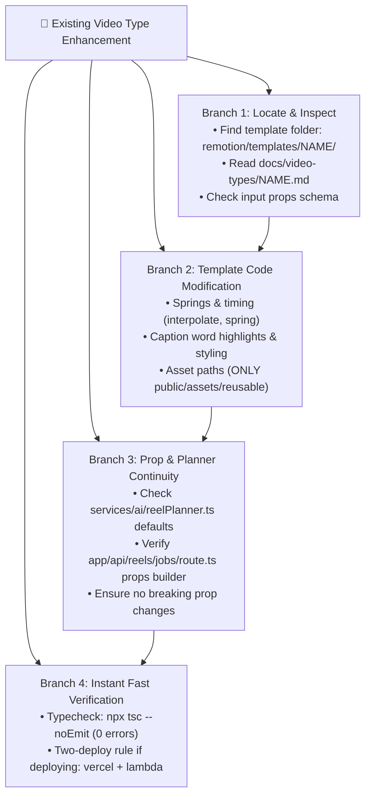
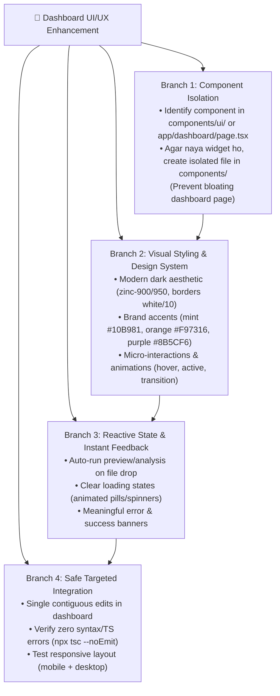

# Itnavideo Fast Execution Work Tree (Speed Framework)

> **Core Focus**: Daily Itnavideo work revolves around **Existing Video Types** and **Dashboard UI/UX Design**. Yeh guide har modification ko structured, fast aur bug-free tareeqe se execute karne ke liye hai.

---

## 🎨 1. Existing Video Types Iteration Tree (Motion, Captions & Polish)

Jab kisi existing video type (jaise *Auto Caption*, *Compare*, *Long Video Promo*, *Typography*, *Whiteboard*, *Multi Images*) mein changes karne hon:

### ⚡ Video Type Speed Checklist:
- **Rule 1 (Asset Storage)**: Template folders are strictly code-only. Reusable assets belong in `public/assets/reusable/*`. Run `npm run assets:index` if new assets are added.
- **Rule 2 (No Breaking Props)**: Agar template mein koi naya prop add ho raha ho, toh uska default value hamesha define karein taake purane render jobs fail na hon.
- **Rule 3 (Fresh Captions)**: Template hamesha current upload ke transcript par kaam karega, purane titles ya cached data ko carry over nahi karega.

---

## 💻 2. Dashboard UI/UX Design Iteration Tree

Jab website ya dashboard ke user interface, controls, cards ya modals par kaam ho:

### ⚡ UI/UX Speed Checklist:
- **Keep Dashboard Clean**: Badi complex UI ko direct `app/dashboard/page.tsx` ke andar 500 lines likhne ke bajaye `components/` mein alag component file banakar import karein. Isse dashboard maintainable aur fast rehta hai.
- **Micro-State Clarity**: Har button aur control ka visual feedback ho (disabled opacity, loading text, active color).
- **Targeted Code Changes**: Dashboard file ~5,000 lines ki hai. Hamesha targeted contiguous line blocks ko edit karein taake doosre video types ke controls disturb na hon.

---

## 🚀 3. Speed Principles (Kaam ko Double Fast Karne ke Niyam)

1. **Direct Component Targeting**: Kaam shuru karne se pehle exact file aur line number target karein — puri file ko scan karne mein time waste na ho.
2. **Component Modularity**: Dashboard mein nayi features ke liye `components/` use karein taake page compile fast ho aur merge conflicts na hon.
3. **Instant Compilation Check**: Har visual ya logic change ke baad `npx tsc --noEmit` run karein taake koi silent syntax ya type error na reh jaye.
4. **Isolated Scratch Testing**: Complex calculations ya formatting ke liye chhota 10-line scratch script test karein.

---

## 📦 4. New Video Type (Reference Pipeline)
Agar future mein kabhi koi naya video type banana ho, toh 7-node pipeline:
`remotion/templates` ➔ `remotion/index.tsx` ➔ `reelPlanner.ts` ➔ `app/dashboard/page.tsx` ➔ `app/api/reels/jobs` ➔ `npx tsc` ➔ `deploy pair`.
