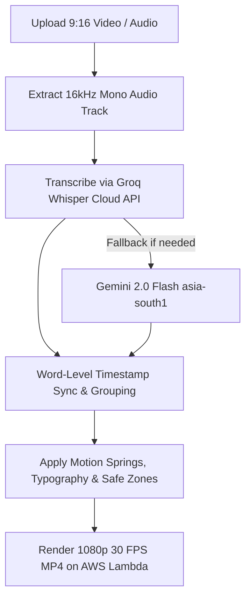

# Auto Caption Generator (`autocaption.md`)

## 1. Overview & Purpose
**Auto Caption Generator** is Itnavideo's executive and high-retention video captioning engine built for short-form (TikTok, Instagram Reels, YouTube Shorts) and long-form captioned video. It transcribes spoken dialogue with Groq Whisper, calculates word-level precision timestamps, and burns in viral caption animations (Alex Hormozi style, Corporate Executive, MrBeast impact, Submagic glow, dynamic M3 pills, bouncy spring physics, and auto-fit safe zones).

The dedicated studio dashboard (`/dashboard/auto-caption`) features a **Strictly 9:16 Vertical & Video-First Motion Studio**:
- **Strictly 9:16 Vertical Only**: Optimized for Instagram Reels, YouTube Shorts, and TikTok (1080×1920 Full HD). Widescreen/YouTube scrubber offsets have been purged for a clutter-free experience.
- **Video-Only Style Selection**: Outdated static text chips and modal lists are replaced by a rich, video-first motion gallery (`AutoCaptionStyleCarousel.tsx`) featuring real video loop previews across categories (Hormozi, MrBeast, Kinetic, Glow, Cinematic, Podcast, Minimal).
- **Two-Column Responsive Stage**:
  - **Left Column**: Fast video dropzone (up to 3 min), spoken & subtitle language selectors, Smart Script Review & Word Replacer (`AutoCaptionWordReplacer.tsx`) to fix brand names in 1 click, and a collapsible `⚙️ Advanced Settings` drawer for caption positioning and fonts.
  - **Right Column**: 9:16 phone-framed live player (`AutoCaptionBeforeAfterPlayer.tsx`) with real-time active subtitles, prominent `Generate 9:16 Reel (1080p Full HD)` button, and 1-click `Download Subtitles (.SRT)` export.
  - **Bottom Dock**: Full-width video style carousel displaying animated loops for 100+ styles.

---

## 2. Key Specifications & Limits

| Attribute | Specification |
| :--- | :--- |
| **Video Type ID** | `auto-caption` / `AUTO_CAPTION_GENERATOR` |
| **Composition ID** | `AUTO_CAPTION_GENERATOR` |
| **Template Location** | `remotion/templates/AUTO_CAPTION_GENERATOR/template.tsx` |
| **Dashboard Studio** | `components/dashboard/AutoCaptionStudio.tsx` |
| **Dashboard Route** | `/dashboard/auto-caption` |
| **Showcase Player** | `components/dashboard/AutoCaptionBeforeAfterPlayer.tsx` |
| **Style Asset Directory**| `itnavideo-assets/autocaptionvideos/*.mp4` (100 Cloudinary preview videos) |
| **Aspect Ratio** | **9:16 Vertical Only (1080×1920 Full HD)** |
| **Resolution & Quality** | **1080p Full HD (1080×1920 for 9:16 / 1920×1080 for 16:9)** |
| **Frame Rate** | 30 FPS |
| **Max Video Duration** | **3 Minutes (180s)** for 9:16 Reels/Shorts / **12 Minutes (720s)** for 16:9 Subtitles |
| **Primary Category** | Creator & Corporate Reels |
| **Credit Cost** | 1 credit per render |
| **Design System** | Google Analytics Obsidian Baseline (`#070B14`, `#0E1526`) + Intentional Color & Typography Variety Policy + Material Design 3 |
| **Transcription Engine**| Extracted 16kHz audio → Groq Whisper Cloud API (Fallback: Gemini 2.0 Flash `asia-south1`) |
| **Cloud Engine** | AWS Lambda (Remotion in `us-east-1` Mumbai) |

---

## 3. User Inputs & Upload Requirements

1. **Talking-Head / Short Video or Audio (Required)**:
   - Formats: MP4, MOV, WEBM, MP3, WAV, M4A.
   - Resolution: 9:16 vertical (1080×1920 1080p Full HD) or 16:9 (1920×1080 1080p Full HD) for YouTube subtitles.
   - Audio quality: Clear spoken voice (English or Roman Hinglish).
   - Audio Extraction Rule: Heavy media is never sent directly to Groq. 16kHz mono audio is extracted first.
2. **Caption Theme & Animation Style (100 Presets, including 19 Kids and Animation styles)**:
   - `Creator 3`: Hormozi-style lime pop with dark drop shadow and bold punch.
   - `Crazy Gradient`: Dynamic animated violet/fuchsia gradient fill with stroke.
   - `Spark Glow`: Radiant golden spark glow for motivational and luxury hooks.
   - `Gamer Bold`: High-energy gaming font with bold borders and neon green punch.
   - `Cursive Contrast`: High-end italic serif/script contrast for podcast gems.
   - `Discipline Red`: High-urgency crimson text for fitness and mindset reels.
   - `Kinetic Multicolor`: Word-by-word cycling neon colors for maximal retention.
   - `Impact Glow`: Heavy condensed bold with ambient white/cyan illumination.
   - `Red Wipe`: Horizontal red highlight wipe across active spoken words.
   - `Punch Yellow`: Fast punchy yellow subtitle pop favored by top creators.
   - `Master Pill`: Clean high-contrast pill backdrop container.
   - `Solo Pop`: Single prominent word at center screen with bounce physics.
  - Kids creators: `Rainbow Pop`, `Bubble Bounce`, `Storybook Spark`, `Crayon Caption`, `Candy Karaoke`, `Toon Word Pop`.
  - 2D animation: `Comic Burst 2D`, `Cel Shade 2D`, `Anime Kinetic 2D`, `Flat Motion 2D`, `Pixel Pop 2D`, `Cutout Story 2D`.
  - 3D creators: `Toy Block 3D`, `Depth Pop 3D`, `Chrome Bounce 3D`, `Holo Glass 3D`, `Neon Voxel 3D`, `Orbit Motion 3D`, `Cinema Depth 3D`.
3. **Enterprise Tone & Compliance Modes**:
   - `Corporate Executive`: Clean subtle highlight with minimal distraction, calibrated for internal briefings, boardroom videos, and stakeholder reports.
   - `Keynote Stage`: High-impact typography with elegant gold/white highlights for CEO keynotes and company announcements.
   - `Social Engagement`: Dynamic bouncy kinetic word springs designed for viral shorts, marketing clips, and thought-leadership reels.
4. **Supported Caption Languages**:
   - English (Original Speech)
   - Hinglish (Roman Script - Hindi speech converted to clean Latin text)
   - *Note*: Multi-language translation APIs are paused. Subtitles match uploaded audio in English or Roman Hinglish.
5. **Typography & Direct Style Gallery (No Category Filters)**:
   - **Direct Style Access Policy**: Style presets are displayed directly in a unified, high-converting visual gallery without category filter tabs. Users do not navigate category filters; they select styles directly from the visible preview grid.
   - Font family: Impact, Montserrat, Anton, Inter, Archivo Black, Syne, Fraunces.
   - Screen placement: Top, Center, Bottom (Safe zone margin compliant).
   - Word pop click sound: Optional subtle typewriter/pop audio on word transition.

---

## 4. Dedicated Processing Pipeline (UI Stepper)

> [!CAUTION]
> **No Asset Matching & No AI Storyboarding**: Auto Caption operates directly on the user's uploaded video or audio. Never show "Matching visual assets" or "Planning AI scenes" in the stepper.



### UI Stepper Stages:
1. **Video Upload & Audio Extraction**: Extracting 16kHz mono audio track, verifying duration (<= 180s for 9:16 / <= 720s for 16:9), and routing audio to Groq Whisper (Fallback: Gemini). Heavy video is never sent directly to Groq.
2. **Groq Whisper Transcription**: High-accuracy speech recognition with millisecond word timestamps.
3. **Word Timestamp Grouping**: Clustering words into 3-5 word readable chunks (max 1.5s per chunk).
4. **Caption Styling & Safe Zone Fit**: Aligning words to 9:16 UI overlay safe margins (avoiding IG reels UI buttons).
5. **Render Final Reel**: AWS Lambda Remotion engine encoding 1080p 30 FPS MP4 with burned-in animated subtitles.

---

## 5. Remotion Composition Props

```typescript
export interface SubtitleWord {
  word: string;
  start: number; // in seconds
  end: number;   // in seconds
}

export interface SubtitleChunk {
  text: string;
  words?: SubtitleWord[];
  start: number;
  end: number;
}

export interface AutoCaptionGeneratorProps {
  mediaSrc: string;
  captions?: SubtitleChunk[];
  subtitleChunks?: SubtitleChunk[];
  captionStyle: string; // Preset key e.g. "Creator 3", "Submagic Glow", "Crazy Gradient"
  textColor?: string;
  highlightColor?: string;
  activeWordColor?: string;
  backgroundColor?: string;
  captionPosition?: "top" | "center" | "bottom";
  fontSize?: "small" | "medium" | "large" | "xlarge";
  fontFamily?: string;
  showBackground?: boolean;
  watermark?: boolean;
  wordClickSound?: boolean;
  captionEmphasisAnimation?: "bounce" | "glow" | "none";
  language?: string;
}
```

---

## 6. Language & Script Policy
- **Supported Outputs**: English and Roman Hinglish captions.
- **Strict Latin/Roman Script**: Clean typography rendering without Devanagari script clipping.
- **Word-Level Sync**: Millisecond-accurate word timing synced directly to spoken dialogue.

---

## 7. Edge Cases & Safeguards
- **Platform UI Interference (23% Safe Zone)**: Y-position presets default to `bottom: 23%` (or 22%-24% safe padding) to stay completely clear of Instagram Reels / TikTok bottom user handles, captions & CTA buttons.
- **Audio SFX Debouncing**: Word click SFX enforced with a 120ms minimum gap (`minFrameGap = Math.ceil(0.12 * DEFAULT_FPS)`) to prevent audio popping on rapid dialogue.
- **Adaptive Font Scaling for Long Words**: Words $\ge 12$ characters scale down font size by 15%–20% to prevent container clipping in pill overlays.
- **Transcription Fallback**: If Groq Whisper Cloud API encounters rate-limits or downtime, system automatically falls back to Gemini 2.0 Flash (`asia-south1`).

---

## 8. Visual-First Studio Stage, Cloud Video Playback & Real Animation Previews
- **Zero Static Screenshots Policy**: All static poster overlays, screenshots, and mock text canvases have been completely replaced with genuine cloud video streams. Every caption style renders an actual HTML5 `<video>` element loaded from Cloudinary (`itnavideo-assets/autocaptionvideos/${videoFilename}`).
- **Top Video Stage (`AutoCaptionBeforeAfterPlayer.tsx`)**:
  - Always active: before user upload, it streams the selected caption style's real Cloudinary Full HD video showing authentic synchronized caption animations.
  - Upon user file upload, it seamlessly switches to the user's uploaded video with real-time kinetic subtitle simulation.
- **Dedicated Style Video Carousel (`AutoCaptionStyleCarousel.tsx`)**:
  - All 100 Shorts styles map one-to-one to 100 Cloudinary preview videos with saved transcripts; each card plays its clip with synced caption overlay and a matching Cloudinary-generated frame poster while the video buffers.
  - Run `node scripts/generate-autocaption-posters.mjs` after adding preview videos to warm the cached frame posters for every completed catalog entry.
  - Each Cloudinary preview card overlays its matching saved, word-timed transcript while playing, positioned in the lower safe area; user-uploaded media never receives an unrelated catalog transcript.
  - When a user clicks or selects any style card (`isSelected || isPlaying`), the video immediately plays with full caption kinetics and synchronized sound.
  - Hover-preview support: moving cursor over any card initiates instant video playback with zero UI stutter.
  - Controls: Dedicated Play/Pause, Mute/Unmute audio, and Favorite toggles on every card.
- **Cloud Storage & Mapping**:
  - Video repository: `https://res.cloudinary.com/dhouh9idx/video/upload/f_auto,q_auto/itnavideo-assets/autocaptionvideos/${videoFilename}`.
  - All 100/48 style variants map directly to verified 1080p Cloudinary videos with deterministic fallback covering every preset.

---

## 9. Modern Interactive Render Screen & Progress Engine
- **Zero Blue Colors**: Fully unified under the **Google Analytics Dark Theme** (`#070B14`, `#0E1526`, `#151E30`) with warm orange accents (`#FF6D00` $\to$ `#FF8F00` $\to$ `#FFA726`).
- **Animated BorderBeam (`BorderBeam.tsx`)**: Glowing dynamic border beam orbits the render container while generating.
- **Neural Audio Visualizer (`AudioSpectrumVisualizer.tsx`)**: Live soundwave frequencies pulse during Groq Whisper transcription and frame compilation.
- **Dedicated 4-Stage Stepper**:
  1. `Project Prep` — Parsing audio stream & aspect safe zones
  2. `Groq Whisper` — Transcribing speech with millisecond precision
  3. `Kinetic Subtitles` — Applying karaoke word bounce & neon highlights
  4. `1080p Cloud Render` — AWS Lambda rendering 1080×1920 Full HD MP4
- **Live Time Remaining**: Displays live elapsed time and accurate countdown (`~35s remaining`).
- **1080p Full HD Player & Social Copy**: Embedded video player upon completion, direct download action, and 1-click social media title/description/hashtag generator.
