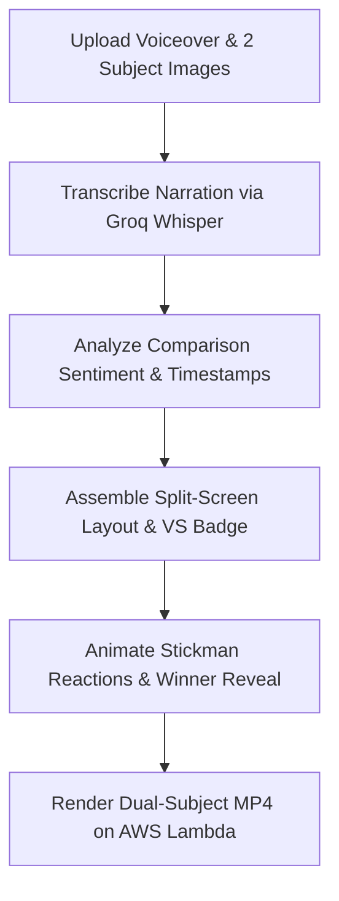

# Compare Explainer Video (`compareexplainer.md`)

## 1. Overview & Purpose
**Compare Explainer Video** creates high-converting versus comparison reels and head-to-head product showdowns (e.g., *iPhone vs Android*, *React vs Vue*, *Good Habit vs Bad Habit*). It utilizes a dual-subject split screen, animated sticker presenter avatars, dynamic VS badges, score counters, and bottom-strip subtitles.

---

## 2. Key Specifications & Limits

| Attribute | Specification |
| :--- | :--- |
| **Video Type ID** | `compare-explainer` / `COMPARE_EXPLAINER` |
| **Composition ID** | `comparisonImages` |
| **Template Location** | `remotion/templates/COMPARE_EXPLAINER/template.tsx` |
| **Dashboard Studio** | `components/dashboard/CompareExplainerStudio.tsx` |
| **Dashboard Route** | `/dashboard/compare-explainer` |
| **Aspect Ratio** | **Strictly 9:16 Vertical (1080×1920 Full HD)** |
| **Resolution & Quality** | **1080p Full HD (1080×1920 30 FPS MP4)** |
| **Frame Rate** | 30 FPS |
| **Max Video Duration** | **3 Minutes (180 seconds)** |
| **Primary Category** | Social & YouTube |
| **Credit Cost** | 1 credit per render |
| **Design System** | Google Analytics Obsidian Baseline (`#070B14`, `#0E1526`) + Intentional Color & Typography Variety Policy + Material Design 3 |
| **Transcription Engine**| Extracted 16kHz audio → Groq Whisper Cloud API (Fallback: Google Gemini 2.0 Flash `asia-south1`) |
| **Image Backdrop** | Adaptive blurred ambient backdrop (`blur(22px)`) eliminating empty letterboxing |
| **Safe Collisions** | Caption layered at `z-index: 25`, presenter avatar scaled and clamped with dedicated margin |

---

## 3. User Inputs & 4-Step Studio Architecture

> [!IMPORTANT]
> **Core Architecture & Dashboard Principle**:
> **"User controls only what changes the content. System AI controls everything else."**
> 
> - **User Inputs (Content Essentials Only)**:
>   1. Voiceover Narration
>   2. Image A
>   3. Image B
>   4. Name A
>   5. Name B
>   6. Presenter Character
>   7. Instagram handle (optional)
> 
> - **System AI Automation Engine (Zero Manual Burden)**:
>   - ⚡ **Poses & Gestures**: Synced dynamically with spoken beats.
>   - ⚡ **Expressions**: Emotion-matched (thinking, confident, winner reveal).
>   - ⚡ **Pacing & Timing**: Millisecond-accurate word alignments from Groq Whisper.
>   - ⚡ **Transitions**: Automatic split-screen whips, zooms, and dual-focus shifts.
>   - ⚡ **SFX**: Sound design (whooshes, versus dings, point hits).
>   - ⚡ **Captions**: High-contrast kinetic auto-subtitles.
>   - ⚡ **Animations & Scene Changes**: Deterministic 1080p 30 FPS composition.
> 
> *(Removing heavy Live Canvas Previews perfectly aligns with this engine, reducing client memory footprint to zero and delivering flawless final outputs on cloud render).*

1. **Step 1: Your Voiceover (Required)**:
   - Voice discussing comparison points, pros, cons, and verdict (`.mp3` or `.wav`).
   - Limit: Up to 3 Minutes (180 seconds). Raw video/audio is processed as extracted 16kHz mono audio.
2. **Step 2: Your Comparison (Required)**:
   - **Option A (Left)**: Upload Image A + assign Name A (Title).
   - **Option B (Right)**: Upload Image B + assign Name B (Title).
   - Clean paired visual cards with instant preview and live 2/2 ready status.
3. **Step 3: Choose Character (Required)**:
   - Organized into 3 stacked sections with circular avatar cards showing 100% full character views:
     - **Section 1: 2D Characters**: `2d-presenter-man` (2D Anime Teacher), `2d-sketch-artist` (2D Sketch), `2d-vector-creator` (2D Vector Creator).
     - **Section 2: 3D Characters**: `casual-guy-3d`, `doctor-pro-3d`, `hijab-teacher-3d`, `action-hero-3d`, `genz-creator-3d`, `student-researcher-3d`, `kid-and-dog-3d`, `young-creator-3d`, `arab-boy-3d`.
     - **Section 3: Realistic Characters**: `doctor-pro-real` (Realistic Doctor), `student-researcher-real` (Realistic Analyst), `tech-founder-real` (Realistic Presenter).
   - Poses & expressions automatically match voiceover pacing and topic direction.
4. **Step 4: Generate**:
   - Optional Instagram / Channel Handle tag (`@yourchannel`).
   - 1-Click render CTA triggering automated split-screen framing, dynamic zooms, auto-captions, and winner reveals.

---

## 4. Dedicated Processing Pipeline (UI Stepper)

> [!CAUTION]
> **No Stock Asset Search**: Visual subjects are provided directly by user uploads. Stepper must never claim to search external libraries.



### UI Stepper Stages:
1. **Upload Verification**: Checking Subject A & B assets and voiceover track.
2. **Transcribe Voiceover**: Groq Whisper extracting timestamps and dialogue structure.
3. **Assemble Split Layout**: Positioning dual cards, subject labels, and center VS badge.
4. **Animate Reactions**: Synchronizing sticker presenter gestures and winner highlight.
5. **Render Comparison MP4**: Remotion Lambda rendering 30 FPS composition.

---

## 5. Remotion Composition Props

```typescript
export interface CompareExplainerProps {
  audioUrl: string;
  totalDurationInFrames: number;
  fps: number;
  leftSubject: {
    title: string;
    imageUrl: string;
    score?: number;
  };
  rightSubject: {
    title: string;
    imageUrl: string;
    score?: number;
  };
  theme: 'light' | 'dark' | 'bold';
  tone: 'versus' | 'goodBad';
  winner: 'left' | 'right' | 'none';
  stickmanPreset?: 'thinking' | 'pointing' | 'winner';
  subtitles?: {
    text: string;
    startFrame: number;
    endFrame: number;
  }[];
}
```

---

## 6. Layout & Motion Specifications
- **Split Ratio**: 50/50 vertical division (top/bottom on 9:16, left/right on 16:9).
- **VS Center Badge**: Scale pulse spring (`scale: 1.0 -> 1.15`) on beat drops.
- **Winner Reveal**: At 80% video mark, the winning card scales up with a gold/amber glowing border while the runner-up dims to 60% opacity.

---

## 7. Edge Cases & Safeguards
- **Missing One Image**: Studio validation blocks render trigger until both Subject A & Subject B images are uploaded.
- **No Speech**: Groq returns `NO_SPEECH_DETECTED`; render is aborted with clear prompt.
- **Aspect Ratio Fit**: Images are auto-contained with clean padding and shadow to avoid distortion.

---

## 8. Showcase & Homepage Assets
- **Demo Video URL**: `https://storage.googleapis.com/itnavideo-assets/homepage/compare-explainer-demovideo.mp4`
- **Output Verified**: 9:16 vertical MP4 comparing Coupon vs Voucher with dual cards, animated presenter character, and synced bottom subtitles.
