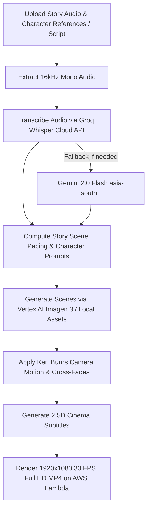

# Image to Video AI (`imagetovideoai.md`)

## 1. Overview & Purpose
**Image to Video AI** is Itnavideo's flagship cinematic narrative & story video creator. Its **primary use case is visual story creation, user narrative storytelling, and cinematic explainers**. It transforms user-uploaded voiceover narration audio, script stories, and character references into a cohesive 16:9 widescreen cinema-grade story video. It incorporates subtle Ken Burns camera motion (pan/zoom), smooth cross-dissolve scene transitions, and timed 2.5D frosted subtitles. (Note: External Pexels API fallback is completely removed; all visuals are generated directly via Vertex AI Imagen 3 / Gemini 2.0 or selected from the curated local Itnavideo library).

---

## 2. Key Specifications & Limits

| Attribute | Specification |
| :--- | :--- |
| **Video Type ID** | `image-to-video` / `IMAGE_TO_VIDEO_AI` |
| **Composition ID** | `IMAGE-TO-VIDEO-AI` |
| **Template Location** | `remotion/templates/IMAGE_TO_VIDEO_AI/template.tsx` |
| **Dashboard Studio** | `components/dashboard/ImageToVideoStudio.tsx` |
| **Dashboard Route** | `/dashboard/image-to-video` |
| **Aspect Ratio** | 16:9 Cinema Widescreen |
| **Resolution & Quality** | **1920×1080 (1080p Full HD)** |
| **Frame Rate** | 30 FPS |
| **Max Audio Duration** | Up to **12 minutes** (720 seconds) |
| **Primary Category** | Cinema, Narrative Stories & Explainers |
| **Credit Cost** | Standard tier credit allocation based on duration |
| **Design System** | Google Analytics Obsidian Baseline (`#070B14`, `#0E1526`) + Intentional Color & Typography Variety Policy + M3. See [`COLOR_DESIGN_SYSTEM.md`](file:///c:/Users/user/.gemini/antigravity/scratch/itnavideo/COLOR_DESIGN_SYSTEM.md) |
| **Speech Transcription** | Extracted 16kHz audio → Groq Whisper Cloud API (Fallback: Gemini 2.0 Flash `asia-south1`) |
| **Cloud Engine** | AWS Lambda (Remotion in `us-east-1` Mumbai) |

---

## 3. User Inputs & Dashboard Workflow (4 Simple Steps)

1. **Step 1 — Your Audio / Story Narration (Required)**:
   - Upload voiceover narration audio (MP3, WAV, M4A, AAC — 12 min max). Raw video is never sent directly to Groq; lightweight 16kHz mono audio is extracted first.
2. **Step 2 — Your Story Visuals & AI Character Consistency**:
   - **`AI Generated (Consistent Characters)` (Primary for User Stories)**:
     - **Main Character (Required)** + **Character 2 (Optional)** + **Character 3 (Optional)** image reference uploads for character consistency across story scenes.
     - **Hard Constraint Visual Style**: `2D`, `3D`, or `Realistic` enforced strictly across all scenes.
     - **Gemini 2.0 / Vertex AI Scene Planner**: Plans story beats dynamically (~5-6s fast / ~9-10s explanatory) with scene visual prompts.
     - **Vertex AI Imagen 3 Customization Engine**: Generates character-consistent images passing subject/style references.
     - **Direct Timeline Assignment**: Bypasses runtime external image search during rendering; each scene knows its exact generated image URL.
     - **Individual Image Regeneration (`[ 🔄 Regenerate Image ]`)**: Regenerate any specific scene image on demand while preserving style, character references, and script context.
     - **Resilient S3 Media Storage**: Saves generated images asynchronously to AWS S3; if S3 fails, falls back gracefully to Data URLs so render jobs never fail.
   - **`Itnavideo Assets` (Default)**: Match narration to selected 2D, 3D, or Realistic local image library.
   - **`User Uploaded Images`**: Upload custom images/screenshots. Use only these images; do not add stock photos.
   - **`Mix`**: Place uploaded images at key story beats and fill remaining scenes from local Itnavideo style library.
3. **Step 3 — Captions & Subtitles**:
   - Clean neutral dark slate subtitle cards (`bg-gradient-to-br from-[#070B14] via-[#0E1526] to-[#070B14]`) showing high-contrast visual style previews without title clutter.
4. **Step 4 — Interactive Timeline & Script Editor**:
   - Timestamped scene blocks mapping narration duration to sequential narration lines.
   - **Editable Transcript**: Edit narration speech lines per scene directly on the timeline.
   - **1-Click Image Swap**: Swap any scene's image with a local file upload trigger.
   - **Map Unique Images 1:1**: 1-click button to distribute uploaded images across scenes sequentially without repeating images.
5. **Unified Fixed Bottom Generate Bar**:
   - Single clean sticky bar showing status (`✓ Audio Ready  ✓ Visuals  12:00 Max  ~X credits`) + `[ Generate Video → ]`.

---

## 4. Dedicated Processing Pipeline (UI Stepper)

> [!IMPORTANT]
> `User Uploaded Images` mode strictly uses user images. External Pexels API dependencies have been completely removed across all modes.



### UI Stepper Stages & Pacing Rules:
Pexels fallback uses the server-only `PEXELS_API_KEY` from `.env.local`; it is capped at 24 missing or weak scene matches per render and never runs in `User Uploaded Images` mode.

1. **Audio & Media Prep**: Validating audio file, extracting 16kHz mono audio, verifying duration (<= 720s).
2. **Transcribe Narration**: Groq Whisper speech-to-text generating word-level timestamps (Fallback: Gemini 2.0 Flash).
3. **Custom Visual Directions (`userPrompt`)**: Accepts optional user visual directions (e.g., *"Fast cuts, show invoice screenshot on billing..."*), adjusting scene target durations and keyword prioritization.
4. **Strict 1.8s–4.2s Semantic Pacing Engine**:
   - `MIN_IMAGE_DURATION = 1.8` seconds.
   - `MAX_IMAGE_DURATION = 4.2` seconds.
   - Long narration gaps are automatically split into ~2.2s–3.5s visual beats aligned with sentence boundaries.
   - Uniform mathematical division (`totalAudioDuration / imageCount`) is strictly forbidden — eliminating 15s–30s frozen frames even when few images are uploaded.
5. **Anti-Repetition & 35s Cooldown Enforcer**:
   - `COOLDOWN_SECONDS = 35.0` seconds.
   - No image URL or asset ID is reused within 35 seconds of video runtime, and NEVER in two consecutive scenes.
   - When uploaded images are on cooldown or exhausted, the system dynamically pulls matching stock assets or falls back to `ImpactTypographyScene` cards.
6. **Cinematic Parallax & Motion**: Generating smooth camera motion (`zoom-in`, `zoom-out`, `pan-left`, `pan-right`) and cross-dissolves.
7. **Render 16:9 Full HD MP4**: Cloud render via Remotion AWS Lambda (`IMAGE_TO_VIDEO_AI`).

---

## 5. Remotion Composition Props

```typescript
export interface ImageToVideoScene {
  id: string;
  imageUrl: string;
  startFrame: number;
  durationInFrames: number;
  motionType: 'zoom-in' | 'zoom-out' | 'pan-left' | 'pan-right' | 'subtle-drift';
  captionText?: string;
}

export interface ImageToVideoAiProps {
  audioUrl: string;
  totalDurationInFrames: number;
  fps: number;
  scenes: ImageToVideoScene[];
  subtitles?: {
    text: string;
    startFrame: number;
    endFrame: number;
  }[];
  theme?: {
    fontFamily: string;
    primaryColor: string;
    subtitlesEnabled: boolean;
  };
}
```

---

## 6. Visual Design & Motion System
- **Google Analytics Palette**: Deep canvas (`#070B14`, `#0E1526`), warm orange accents (`#FF6D00` to `#FF8F00`) on UI controls and progress meters. See [`COLOR_DESIGN_SYSTEM.md`](file:///c:/Users/user/.gemini/antigravity/scratch/itnavideo/COLOR_DESIGN_SYSTEM.md).
- **Edge-to-Edge 16:9 Cinema & Zero Pillarboxing**: Default `fitMode: 'cover'` with `objectFit: 'cover'` and `objectPosition: 'center center'` across all image layers guarantees zero black margins or pillarboxing. Non-16:9 or vertical images are seamlessly cropped edge-to-edge.
- **Dynamic Pacing (Max 4–6s per Scene)**: No visual scene remains frozen for > 6 seconds. Scenes are strictly capped between 3.5s and 5.5s; longer narration blocks are split into 2 visual cuts.
- **Continuous Ken Burns Motion**:
  - Smooth scale interpolation across parent asset duration: When an asset is subdivided across multiple cuts, `parentStartSeconds` and `parentEndSeconds` maintain continuous scale interpolation (`1.02` ➔ `1.12`) across all cuts without abrupt scale resets.
  - Pan vector: Subtle translation (`0%` to `±0.8%` / `±2.0%`) for natural cinematic movement.
- **35mm Film Grain & Vignette Overlay**:
  - `<FilmGrainOverlay />` applies a subtle 2.5% SVG noise texture (`feTurbulence`) + radial edge vignette overlay at `zIndex: 80`.
- **2-Line Subtitle Clamping**:
  - Subtitle text clamped to maximum 2 lines (`WebkitLineClamp: 2`, `maxHeight: '2.6em'`) and 14 words max per active chunk to eliminate bottom visual occlusion.
- **Zero Canvas Overlay Rule**: The top-left corner topic/filename badge (`sanitizedTitle` overlay) has been permanently removed so uploaded audio file names (e.g. `Testing1.mp3`) never render on top of the video canvas.
- **Cross-Fade Transitions**: Smooth opacity and slide-push blending between sequential scenes.

---

## 7. AI Vision-Based Scene Matcher & Single-Call Batch Multimodal Analysis

> [!IMPORTANT]
> **Custom Upload AI Vision Matching Pipeline**:
> 1. **Batch Multimodal Vision Analysis (Single Call)**:
>    - Rather than heavy individual image calls (which caused `429 RESOURCE_EXHAUSTED` rate limits), all uploaded images are packed into a **single prompt payload** to Gemini 2.0 Flash / Vision.
>    - Extracts visual subjects, core actions, detected objects (e.g., `money`, `stock market chart`, `city skyline`, `desk`), mood, and positive keywords in **1 single API request**.
> 2. **Semantic Script-to-Image Matching Logic**:
>    - Narration text is semantically compared against the batch-analyzed visual tags:
>      - *"While inflation quietly destroys ordinary savings..."* → Binds image with detected cash/money/hourglass.
>      - *"Low-cost index funds and real estate..."* → Binds image with stock chart/property/architecture.
> 3. **Strict Rules Enforced**:
>    - **Zero Duplicates**: An image assigned to a scene is added to `usedUserImageIds` and never repeated.
>    - **Surplus Fallback**: When uploaded images are exhausted, remaining scenes automatically transform into clean `<ImpactTypographyScene/>` cards displaying key spoken metrics/words.

---

## 8. Dashboard Project History & Download Features
- **Persistent M3 Switcher**: `[ Studio ]` and `[ Your Videos / Projects ]` persistent tabs right on the dashboard.
- **Robust Render Completion Detection**: Polling acknowledges `state === 'ready'`, `state === 'done'`, and `statusPayload.done` flags with presigned MP4 resolution to eliminate stuck progress screens.
- **Real-time Local & Cloud Sync**: Completed renders are saved to browser `localStorage` (`itnavideo_image_to_video_projects`) and synchronized with `/api/reels/history` in Supabase using mode aliases (`imageToVideoAi`, `IMAGE_TO_VIDEO_AI`).
- **Direct 1080p MP4 Download**: Dual download capability: in-browser blob download with active spinner feedback + direct cloud anchor link fallback.
- **48-Hour Retention**: Automated private cloud retention with timestamp indicators.

---

## 9. Edge Cases & Safeguards
- **Mismatched Image Count**: If audio is 60 seconds and only 2 images are provided, scenes automatically divide equally with continuous subtle motion.
- **Silent or Inaudible Audio**: Groq Whisper returns `NO_SPEECH_DETECTED`; dashboard flags clear error before triggering cloud render.
- **Non-16:9 Images**: Default `cover` scaling guarantees zero black bars for YouTube.

---

## 10. M3 Stepper Flow & Animated Step Narration Guide
- **Interactive 4-Step Rail**:
  - `Step 1: Your Audio` (Upload voiceover narration audio MP3, WAV, M4A, AAC — up to 12 minutes).
  - `Step 2: Your Visuals` (Choose visual mode: 2D, 3D, Realistic, User Uploaded Images, or Mix).
  - `Step 3: Subtitles & Captions` (Select from 10+ 2.5D frosted glass cinema subtitle styles).
  - `Step 4: Background Music & 1080p Export` (Curated studio BGM with smart speech ducking, 1-click cloud render).
- **Dynamic Animated Step Guide (`AnimatedStepGuide`)**:
  - Kinetic typewriter component animating instructions in real-time (~15ms per character).
  - Ambient Google Analytics orange aura (`#FF6D00` to `#FF8F00` to `#FFA726`).
  - Active step status badge, step narration, and YouTube retention pro-tip ticker.

---

## 11. Resilient Render Execution Flow
- **Direct Voiceover Pipeline**:
  - Validates user-uploaded narration audio, generates word-level timestamps via Groq Whisper, and matches sequential scene images.
- **Resilient Button States**:
  - The final Generate button retains tactile M3 micro-interactions (`active:scale-95`, hover elevation) and validates inputs with clear inline M3 alert banners instead of silently failing.

---

## 13. Direct Cloud S3 Asset URLs & Strict Visual Category Isolation

> [!CRITICAL]
> **AWS Lambda Cloud Rendering Asset Guarantees**:
> To prevent image load crashes (`Fs is not defined`, 404s, or relative path errors) inside AWS Lambda Chromium instances in `us-east-1`:
>
> 1. **Pure HTTPS S3 Asset URLs**:
>    - All stock assets, unified images, and user-uploaded media are mapped to fully-qualified public HTTPS S3 URLs (`https://remotionlambda-useast1-2zq6twaok1.s3.us-east-1.amazonaws.com/...` or presigned S3 URLs) using `toAbsoluteS3AssetUrl()`.
>    - Relative local paths (`/assets/...`) are **never** passed to Remotion Lambda.
>
> 2. **Strict Category Isolation (`2D` / `3D` / `Realistic`)**:
>    - Visual style selections (`2d`, `3d`, `realistic`) strictly enforce visual category boundaries.
>    - When the user selects `2D`, only 2D digital illustrations and anime assets are used. Realistic photographic stock images are strictly blocked from 2D renders.
>
> 3. **Pre-Render Asset Validation**:
>    - Before initiating cloud render jobs, every `scene.imageUrl` is validated and resolved to an active, accessible HTTPS S3 URL or Cloudinary CDN fallback.

---

## 14. Live Cloudinary Demo Showcase (Homepage & Studio)
- **5 High-Quality 1080p Cloud Demos**:
  - Rendered widescreen 16:9 MP4 samples hosted on Cloudinary (`itnavideo-assets/Imagetovideoai-homepagevideos`).
  - Integrated in both the Studio workspace ([`ImageToVideoShowcaseCarousel.tsx`](file:///c:/Users/Akram%20Editor%20Studio/.gemini/antigravity/scratch/itnavideo_studio/components/dashboard/ImageToVideoShowcaseCarousel.tsx)) and Homepage ([`ImageToVideoHomepageShowcase.tsx`](file:///c:/Users/Akram%20Editor%20Studio/.gemini/antigravity/scratch/itnavideo_studio/components/landing/ImageToVideoHomepageShowcase.tsx)).
  - Uses Cloudinary `so_3` (3-second start offset) poster generation so full artwork scenes are visible instead of black title screens.


