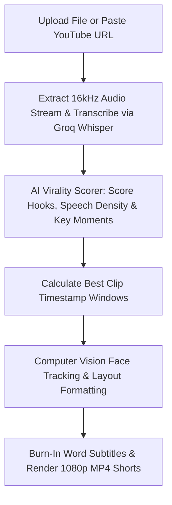

# Long Video to Viral Clips (`longvideoclips.md`)

## 1. Overview & Purpose
**Long Video to Viral Clips** automatically converts lengthy podcasts, YouTube videos, conference talks, and interviews into multiple bite-sized, vertical viral Shorts/Reels with automated subtitles. It uses Computer Vision active speaker face tracking to reframe horizontal 16:9 cameras into 9:16 vertical, evaluates speech density and emotional hooks to extract top moments, and renders 1080p Full HD MP4 clips.

---

## 2. Key Specifications & Limits

| Attribute | Specification |
| :--- | :--- |
| **Video Type ID** | `long-video-clips` / `LONG_VIDEO_CLIPS` |
| **Composition ID** | `LONG_VIDEO_CLIPS` |
| **Template Location** | `remotion/templates/LONG_VIDEO_CLIPS/template.tsx` |
| **Dashboard Studio** | `components/dashboard/LongVideoClipsStudio.tsx` |
| **Dashboard Route** | `/dashboard/long-video-clips` |
| **Aspect Ratio** | 9:16 Vertical |
| **Resolution & Quality** | **1080×1920 (1080p Full HD)** |
| **Frame Rate** | 30 FPS MP4 |
| **Source Video Input** | Up to **3 Hours** (180 minutes / 10,800 seconds) |
| **Input Options** | Dual Input Mode: Direct Video File Upload (MP4, MOV, WEBM) or YouTube URL Paste |
| **Output Clip Length** | **AI Auto** (Flexible natural story arc), **Under 30s**, **30–60s**, **60–90s** |
| **Number of Clips** | **AI Recommended** (Auto-sizes based on content), **3 Clips**, **5 Clips**, **10 Clips** |
| **Primary Category** | Cinema & Long Form |
| **Credit Cost** | Simplified Estimated Cost: approximately 5 credits |
| **Design System** | Google Analytics Obsidian Baseline (`#070B14`, `#0E1526`) + Intentional Color & Typography Variety Policy + Material Design 3 |
| **Transcription Engine**| Extracted 16kHz mono audio stream → Groq Whisper Cloud API (Fallback: Google Gemini 2.0 Flash `asia-south1`) |
| **Rendering Rule** | Full 3-hour video is **never rendered**. AWS Remotion Lambda renders strictly the selected viral clip segments in 9:16 vertical. |

---

## 3. User Inputs & Detection Controls

1. **Dual Source Input (Required)**:
   - **File Upload Tab**: Drag & drop or browse local MP4, MOV, or WEBM up to 3GB.
   - **YouTube Link Tab**: Paste URL (`https://youtube.com/watch?v=...` or `https://youtu.be/...`) with instant regex validation.
2. **Speaker Reframing & Layout Modes (Computer Vision)**:
   - **`Auto Active Speaker` (`auto-speaker`)**: MediaPipe face detection tracks active speaker with dynamic sentence-synced camera jump-cuts (+15% scale punch-in on alternating sentence beats).
   - **`Split Screen` (`split-screen`)**: 2-Person Podcast mode stacking Host in Top 50% (`objectPosition: center 32%` for natural headroom) and Guest in Bottom 50% (`objectPosition: center 68%` for eye-line levels) divided by a Google Analytics Orange accent line.
   - **`Fit Widescreen` (`fit-widescreen`)**: Original 16:9 widescreen video padded with gaussian blurred background backdrop (`blur(28px) brightness(0.35)`).
   - **Playback Safety & Edge Protection**: `<OffthreadVideo>` layers equipped with `pauseOnLoading={false}` to prevent end-frame freezes during clip boundary extends.
   - **Headline Auto-Wrap**: `HeadlineOverlay` dynamically downscales font size for long titles (>32/48 chars) to clamp strictly to 2 lines with Google Analytics Orange keyword accents.
3. **Number of Clips**:
   - `AI Recommended` (Default, value `0`), `3 Clips`, `5 Clips`, `10 Clips`.
4. **Clip Duration**:
   - `AI Auto` (Default, value `"auto"`), `Under 30s`, `30–60s`, `60–90s`. Snaps to natural sentence boundaries.
5. **AI Focus (Virality Hook Strategy)**:
   - `Auto` (Default, combines all 9 viral triggers: strong hooks, opinions, emotions, stories, advice, facts, debates, Q&A, and punchlines), `Educational`, `High Energy`, `Storytelling`.
6. **Captions & Subtitles**:
   - `Captions: ON / OFF` toggle with `Language: Auto Detect` badge via Groq Whisper Cloud engine.

---

## 4. Dedicated Processing Pipeline (UI Stepper)



### UI Stepper Stages:
1. **Source Ingestion**: Connecting to cloud stream / uploading file.
2. **Speech Transcription**: Groq Whisper transcribing audio timeline with word stamps.
3. **Virality & Hook Analysis**: AI evaluates retention scores, emotional hooks, and punchlines.
4. **Active Speaker Reframe**: Centering faces or formatting split-screen podcast layout.
5. **Render Viral Shorts**: AWS Remotion Lambda renders individual 1080p short clips.

---

## 5. Remotion Composition Props

```typescript
export interface LongVideoClipsProps {
  mediaSrc: string;
  mediaTrimStartSeconds: number;
  sourceAudioVolume: number;
  durationSeconds: number;
  aspectRatio: '9:16' | '16:9' | '1:1';
  layoutMode: 'auto-speaker' | 'split-screen' | 'fit-widescreen';
  headline?: string;
  showHeadline?: boolean;
  captions: CaptionSegment[];
  captionStyle: string;
  captionPosition?: 'bottom' | 'center' | 'top';
  textColor?: string;
  highlightColor?: string;
  backgroundColor?: string;
  fontSize?: SubtitleConfig['fontSize'];
  watermark?: boolean;
}
```

---

## 6. Visual Design & Theme System
- Strictly conforms to the **Google Analytics Palette**: Warm Orange (`#FF6D00` / `#FF8F00` / `#FFA726`), Obsidian Canvas (`#070B14`), Surface Container (`#0E1526`), M3 shape system (`rounded-[28px]` cards), and Lucide icons across all options.

---

## 7. Edge Cases & Safeguards
- **YouTube Link Validation**: Instant client-side regex check for valid YouTube domain.
- **2-Person Podcast Detection**: Split-screen layout prevents head cutting by rendering both top and bottom viewports simultaneously.
- **Parallel Render Pipeline**: Renders multiple clips concurrently on AWS Remotion Lambda for zero local laptop compute.
