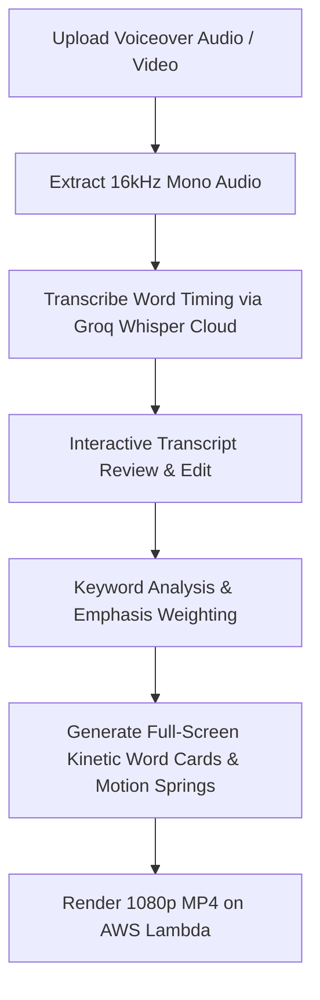

# Kinetic Typography Video (`typographyvideo.md`)

## 1. Overview & Purpose
**Kinetic Typography Video** is an ultra-high retention video format where full-screen typography is the hero visual of the entire frame (distinct from subtitle captions). It features full-screen kinetic compositions, dynamic scale transitions, perspective 3D camera angles, color inversions, and rhythmic spring physics synchronized to audio speech.

---

## 2. Key Specifications & Limits

| Attribute | Specification |
| :--- | :--- |
| **Video Type ID** | `typography-video` / `TYPOGRAPHY_VIDEO` |
| **Composition ID** | `TYPOGRAPHY_VIDEO` |
| **Template Location** | `remotion/templates/AUTO_CAPTION_GENERATOR/template.tsx` / `MotionCaptionRenderer.tsx` |
| **Primitives Location** | `remotion/components/MotionCaptionRenderer.tsx` |
| **Dashboard Studio** | `components/dashboard/TypographyStudio.tsx` |
| **Style Picker Component** | `components/typography/TypographyStylePicker.tsx` |
| **Style Data & Transcripts**| `lib/typography/typographyStylesData.ts` / `lib/cloudinary/typography-transcripts.json` |
| **Dashboard Route** | `/dashboard/typography-video` |
| **Aspect Ratio** | **Strictly 9:16 Vertical (1080×1920 Full HD)** |
| **Resolution & Quality** | **1080×1920 (1080p Full HD 30 FPS MP4)** |
| **Input Media** | **Strictly User-Uploaded Speaking Video / Audio** (MP4, MOV, MP3, WAV up to 3m/180s). *No AI TTS voiceover generation.* |
| **Frame Rate** | 30 FPS |
| **Max Video Duration** | **3 Minutes (180 seconds)** |
| **Primary Category** | Social & YouTube Shorts / Reels / TikTok |
| **Total Available Styles** | **11 High-Impact Motion Presets** (Curated for short-form retention) |
| **Transcript Review & Editing**| **Interactive Word-Level Pre-Render Transcript Editor** (Edit transcription mistakes before render) |
| **Fast-Speech Adaptive Chunking**| Enforces 2-3 word ceiling when speech velocity exceeds 180 WPM |
| **Long-Word Margin Guard**| Auto-downscales font size by 18% for words >12 characters |
| **Transcription Engine**| Extracted 16kHz audio → Groq Whisper Cloud API (Fallback: Google Gemini 2.0 Flash `asia-south1`) |
| **Design System** | Google Analytics Obsidian Baseline (`#070B14`, `#0E1526`) + Intentional Color & Typography Variety Policy + Material Design 3 |

---

## 3. Kinetic Motion Presets (11 Curated High-Impact Presets)

Featuring 11 high-converting kinetic motion presets designed specifically for viral Reels, TikTok, and YouTube Shorts. Each preset includes live 9:16 motion video previews and word-level script editing:

1. `#KM-01 Slam Impact`: High-energy hook, loud statements (`🔥 Viral`).
2. `#KM-02 Elastic Bounce`: Playful, conversational podcast clips (`⚡ Kinetic`).
3. `#KM-03 Word Cascade`: Fast speakers, rapid-fire talking heads (`⚡ Kinetic`).
4. `#KM-04 Cinematic 3D Flip`: Tech reviews, luxury brands, documentary (`🎬 Cinematic`).
5. `#KM-05 Masked Slide`: Clean, premium Apple aesthetic storytelling (`💎 Minimal`).
6. `#KM-06 Glitch Scramble`: Coding, AI, crypto, futuristic themes (`🤖 Cyber`).
7. `#KM-07 Typewriter Cursor`: Storytelling, finance, journal reflections (`💎 Minimal`).
8. `#KM-08 Particle Burst`: Emotional peaks, punchlines, revelation moments (`🔥 Viral`).
9. `#KM-09 Highlighter Sweep`: Educational, breakdowns, tutorial reels (`🎓 Educational`).
10. `#KM-10 Zoom Through`: Dramatic scene shifts, climax sentences (`🎬 Cinematic`).
11. `#KM-11 Fluid Wave`: Calm, lifestyle, travel, reflective reels (`🌊 Lifestyle`).

### A. 🔥 High Impact Kinetic (10 Styles)
| Style ID | Name | Theme & Spoken Transcript | Visual System & Typography | Accent Color |
| :--- | :--- | :--- | :--- | :--- |
| `vox-giant-stagger` | **Vox Typography Stagger** | Documentary rain narrative (`954628595_...`) | Full-screen multi-line stagger, Archivo Black font, marker highlight tape, and high-contrast drop-shadows. | `#FF6D00` |
| `kinetic-marquee-diagonal` | **Diagonal Marquee Flow** | Athletic & streetwear flow (`615669656_...`) | 12-degree tilted dual-track kinetic ticker streaming across frame with alternating filled and stroke outlines. | `#FF6D00` |
| `multi-line-block-slam` | **Brutalist Block Slam** | Heavy order slam (`499250610_...`) | Multi-line stacked block words slamming into frame with heavy spring physics and optical tracking. | `#FFA726` |
| `headliner` | **Headliner Bold Impact** | Creator connection hook (`633420581_...`) | Ultra-heavy condensed grotesque typography with high-contrast yellow/orange word pop. | `#FF8F00` |
| `action` | **Action Magazine Punch** | Hype energy & taste cut (`727444900_...`) | Fast kinetic cuts with high-velocity typography snaps, rotation kicks, and vibrant backplates. | `#FF6D00` |
| `boxing-punch-heavy` | **Heavyweight Slam** | Fitness core power (`805753495_...`) | Explosive punch-in typography with camera shake, screen impact ripples, and bold athletic contrast. | `#EF4444` |
| `bold-ticker-news` | **Breaking News Ticker** | Morning transit broadcast (`650789818_...`) | Dynamic live breaking news lower-third ticker with fast flashing headline tags and kinetic subtitles. | `#FF9100` |
| `the-difference` | **The Difference Contrast** | Brand scale mindset shift (`248946837_...`) | Rapid typography state transitions contrasting two ideas with color flip and zoom momentum. | `#FF8F00` |
| `hormozi-bold` | **Hormozi Kinetic Pop** | Viral hook & brand scale (`1030137386_...`) | Signature Alex Hormozi style with vibrant emoji accents, neon word fills, and rhythmic bounce. | `#FFD600` |
| `viral-redline` | **Viral Redline Box** | Visual AI workflow (`450363977_...`) | Ultra-tight frame-synced red highlight boxes snapping to keywords with subtle spring overshoot. | `#FF3D00` |

### B. 📐 Clean & Editorial Poster (10 Styles)
| Style ID | Name | Theme & Spoken Transcript | Visual System & Typography | Accent Color |
| :--- | :--- | :--- | :--- | :--- |
| `apple-keynote-punch` | **Apple Keynote Punch** | Executive breakfast reveal (`821731532_...`) | Massive centered grotesque typography scaling in with optical motion blur and obsidian ambient glow. | `#FFFFFF` |
| `editorial-magazine-manifesto` | **Editorial Manifesto** | High fashion runway lines (`233285037_...`) | Asymmetric luxury poster composition with giant italic serif quote words, hairline rules, and magazine tags. | `#F8FAFC` |
| `minimal-swiss-clean` | **Ultra Minimal Swiss Grid** | Park stroll coordinates (`120041496_...`) | Pure geometric sans-serif laid out on a rigid asymmetric Swiss grid with micro metadata coordinates. | `#E2E8F0` |
| `cursive` | **Cursive Elegance** | Personality connection (`100932073_...`) | Fluid calligraphic cursive script flowing across key emotional words with hand-drawn stroke timing. | `#FFA726` |
| `chalk` | **Chalk Doodle Notes** | Cafe handwritten notes (`591236388_...`) | Rough texture chalk typography with playful underline doodles and organic hand-drawn borders. | `#FFFDD0` |
| `podcast-quote-card` | **Podcast Quote Card** | Cafe audio conversation (`340435376_...`) | Frosted glass quote container with speaker avatar pill, animated audio waveform, and smooth line reveal. | `#FF9100` |
| `floodlight` | **Floodlight Badge Spotlight** | Daily lifestyle vlog (`651644969_...`) | Warm spotlight illumination focusing on centered typography with elegant ambient light cones. | `#FF8F00` |
| `storyline` | **Storyline Chapter Beat** | Rooftop garden docuseries (`119681421_...`) | Chapter-based narrative layout with progress timeline tracker, subtitle strip, and elegant serif headers. | `#FFB74D` |
| `blue-muse` | **Blue Muse Atmospheric** | Ocean living calm view (`388441493_...`) | Deep ocean blue atmospheric typography with gentle water caustics and smooth luminous glow. | `#38BDF8` |
| `split-color-invert` | **Swiss Color Invert** | Style statement dual tone (`589294697_...`) | 50/50 vertical frame split where typography color inverts seamlessly as it crosses dividing boundary. | `#FFFFFF` |

### C. ⚡ 3D & Cyber HUD Motion (8 Styles)
| Style ID | Name | Theme & Spoken Transcript | Visual System & Typography | Accent Color |
| :--- | :--- | :--- | :--- | :--- |
| `glitch-cyber-rave` | **Glitch Cyber HUD** | Edge AI & telemetry (`931648967_...`) | RGB chromatic aberration split with digital HUD scanlines, frame glitches, and monospaced telemetry. | `#00E5FF` |
| `isometric-3d-flythrough` | **3D Perspective Tunnel** | Spatial tunnel shopping (`748125494_...`) | Dramatic isometric 3D angled planes with kinetic camera push-in and spatial depth blurring. | `#FF6D00` |
| `retro-synthwave` | **Retro 80s Synthwave** | Neon street horizon (`750208776_...`) | Neon magenta and cyan chrome text hovering over an infinite retro wireframe horizon grid. | `#E040FB` |
| `glow-gradient-pill` | **Fluid Aurora Gradient Pill** | Scenic view experience (`453245311_...`) | Floating glass capsule pills with fluid multi-color aurora gradients and organic breath pulses. | `#818CF8` |
| `cinematic-trailer` | **Cinematic 3D Trailer** | Bold vision trailer (`1060477160_...`) | Slow dramatic 3D extrusion titles emerging through volumetric smoke particles and lens flares. | `#FFB300` |
| `gold-centre` | **Gold Centre 3D Metallic** | Coastal estate architecture (`1060539661_...`) | Centered 3D bevel metallic gold typography with reflective glint sweep and dark luxury backdrop. | `#FFD700` |
| `stat-numbers` | **Stat Numbers & ROI** | Wealth perspective metrics (`1025542632_...`) | Oversized animated rolling metric counters and currency indicators with upward momentum sparks. | `#10B981` |
| `architectural-blueprint` | **Blueprint Technical Grid** | Structure scale blueprint (`1071306485_...`) | Cyan architectural blueprint drafting grid with live dimension callouts, angle rulers, and tech markers. | `#00BCD4` |

### D. 🏠 Real Estate & Luxury Tours (6 Styles)
| Style ID | Name | Theme & Spoken Transcript | Visual System & Typography | Accent Color |
| :--- | :--- | :--- | :--- | :--- |
| `dubai-gold` | **Dubai 24K Gold** | Penthouse modern luxury (`826702944_...`) | Polished 24K gold foil typography with specular light sweeps, cinematic letterboxing, and price tags. | `#FFD700` |
| `luxury-listing-stats` | **Luxury Listing Stats** | Modern estate specs (`795046111_...`) | Floating glass spec cards showing price, sq ft, bedroom/bathroom badges, and property highlights. | `#FFA726` |
| `luxury-monogram` | **Monogram High Elegance** | Bespoke luxury precision (`467511457_...`) | Bespoke monogram seal with high-contrast Didot serif typography, gold hairline dividers, and luxury pacing. | `#F59E0B` |
| `realtor-punch-quotes` | **Realtor Authority Quotes** | Location & agent lifestyle (`194080610_...`) | High-authority agent quote badges with verified checkmark, neighborhood tag, and bold quote highlights. | `#FF6D00` |
| `platinum-penthouse` | **Platinum Penthouse** | Pure lines & penthouse view (`105725755_...`) | Sleek brushed platinum and iced chrome typography with cool blue rim lighting for top-floor listings. | `#E2E8F0` |
| `architectural-tour` | **Architectural Tour** | CREC structure tour (`26871195_...`) | Clean architectural tour lower-thirds with marble, travertine, oak material tags and room dimensions. | `#FFA726` |

---

## 4. Dedicated Processing Pipeline (UI Stepper)

> [!IMPORTANT]
> Typography Video accepts audio or video. With video input, source footage remains the background and kinetic typography is composited over it.



### UI Stepper Stages:
1. **Audio Analysis**: Verifying audio quality and speech pacing.
2. **Word-Level Transcription**: Groq Whisper mapping individual start and end timestamps per syllable.
3. **Interactive Script Review**: Interactive word-level editor allows creator to fix typos and transcription mistakes before rendering.
4. **Emphasis & Hierarchy Calculation**: Detecting emphasized nouns, verbs, and numerical values.
5. **Kinetic Layout Engine**: Generating spring-based scale, rotation, and slide-in animations.
6. **Render Kinetic Reel**: Remotion rendering high-frame-rate 1080p MP4 on AWS Lambda.

---

## 5. Remotion Composition Props & Types

```typescript
export type TypographyStyleId =
  | 'vox-giant-stagger'
  | 'apple-keynote-punch'
  | 'kinetic-marquee-diagonal'
  | 'editorial-magazine-manifesto'
  | 'glitch-cyber-rave'
  | 'split-color-invert'
  | 'isometric-3d-flythrough'
  | 'multi-line-block-slam'
  | 'headliner'
  | 'action'
  | 'boxing-punch-heavy'
  | 'bold-ticker-news'
  | 'the-difference'
  | 'hormozi-bold'
  | 'viral-redline'
  | 'minimal-swiss-clean'
  | 'cursive'
  | 'chalk'
  | 'podcast-quote-card'
  | 'floodlight'
  | 'storyline'
  | 'blue-muse'
  | 'retro-synthwave'
  | 'glow-gradient-pill'
  | 'cinematic-trailer'
  | 'gold-centre'
  | 'stat-numbers'
  | 'architectural-blueprint'
  | 'dubai-gold'
  | 'luxury-listing-stats'
  | 'luxury-monogram'
  | 'realtor-punch-quotes'
  | 'platinum-penthouse'
  | 'architectural-tour';

export interface KineticWord {
  word: string;
  startFrame: number;
  endFrame: number;
  isEmphasis?: boolean;
  scale?: number;
  rotation?: number;
  color?: string;
}

export interface TypographyVideoProps {
  mediaSrc?: string;
  mediaType?: 'video' | 'audio';
  durationSeconds?: number;
  keywords?: KineticWord[];
  typographyStyle?: TypographyStyleId;
  sfxIntensity?: 'full' | 'subtle' | 'none';
  pacing?: 'fast' | 'smooth';
  textCase?: 'uppercase' | 'natural';
}
```

---

## 6. Preview & Dashboard Architecture

1. **Zero Unchecked Background Compute**:
   - Initial gallery load does NOT autoplay videos.
   - Each card displays a high-resolution Cloudinary poster screenshot (`.jpg`) instantly with 0ms delay and zero CPU thrashing.
2. **User-Initiated Playback Only**:
   - A video plays ONLY when the user explicitly clicks the card or the Play button.
   - Only the active card plays with sound / unmuted.
3. **Real-Time Word-Synced Kinetic Overlay**:
   - As the video plays, the `<KineticLiveOverlay>` component synchronizes with the video element's `currentTime`.
   - Renders animated words styled according to the active theme using precise timestamps from `lib/cloudinary/typography-transcripts.json`.
4. **Direct Unified Style Gallery (No Category Filters Needed)**:
   - All motion styles are presented directly in a unified, high-converting visual grid.
   - Category filter tabs and filter chips are intentionally omitted because creators pick styles directly from the visible gallery grid rather than filtering by category.
5. **Google Analytics Visual System**:
   - Obsidian base container (`#070B14`), elevated surface (`#0E1526`), GA Orange active ring (`#FF6D00`), and smooth M3 tactile micro-interactions (`active:scale-95`).
