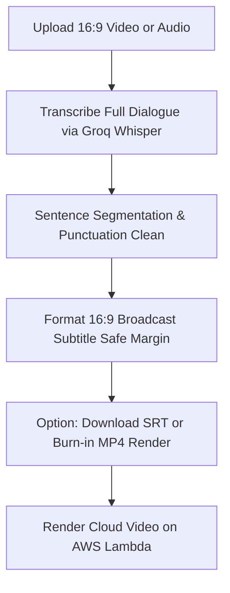

# YouTube Subtitle Generator (`youtubesubtitles.md`)

## 1. Overview & Purpose
**YouTube Subtitle Generator** is designed specifically for creators producing standard 16:9 YouTube videos and long-form video podcasts, with optional 9:16 export support. It delivers pixel-perfect, broadcast-compliant burned-in subtitles with comprehensive typography controls, subtitle safe-margin guarantees, and exportable SRT/VTT caption files.

---

## 2. Key Specifications & Limits

| Attribute | Specification |
| :--- | :--- |
| **Video Type ID** | `youtube-subtitles` / `YOUTUBE_SUBTITLES` |
| **Composition ID** | `AUTO_CAPTION_GENERATOR` / `LONG_CAPTION_PRO` |
| **Dashboard Studio** | `components/dashboard/subpages/YoutubeSubtitlesPageClient.tsx` |
| **Dashboard Route** | `/dashboard/youtube-subtitles` |
| **Aspect Ratio** | **Strictly 16:9 Widescreen (1920×1080 Full HD)** (Default) |
| **Resolution & Quality** | **1920×1080 (1080p Cinema Full HD @ 30 FPS MP4)** |
| **Frame Rate** | 30 FPS |
| **Max Video Duration** | Up to **12 minutes** (720 seconds) |
| **Bottom Safe Margin** | **14% Bottom Margin (`youtubeSubtitleSafeZone: 'scrubber'`)** — clears YouTube scrubber bar & player controls |
| **Line-Wrap Engine** | `formatPunctuationAwareLineBreaks` — breaks multi-word text (>42 chars) strictly at punctuation marks |
| **Export Formats** | Burned-in Full HD MP4 render + Millisecond-Accurate `.srt` / `.vtt` Subtitle Files |
| **Design System** | Google Analytics Obsidian Baseline (`#070B14`, `#0E1526`) + Intentional Color & Typography Variety Policy + Material Design 3 |
| **Transcription Engine**| Extracted 16kHz audio → Groq Whisper Cloud API (Fallback: Google Gemini 2.0 Flash `asia-south1`) |

---

## 3. User Inputs & Upload Requirements

1. **Video or Audio File (Required)**:
   - Formats: MP4, MOV, MP3, WAV, M4A.
   - Max duration up to 12 minutes (720s). Heavy video is never sent directly to Groq; 16kHz mono audio is extracted first.
2. **3-Tier Language Control Pipeline**:
   - **Audio Language (Spoken)**: Auto Detect (Recommended), Hindi / Hinglish, English, etc.
   - **Detected Speech Indicator**: Real-time validation indicator showing detected dialect (`Hindi (Roman Hinglish)` or `English`).
   - **Subtitle Output Language**: Choose output script (`Same as Audio`, `English (Latin)`, `Hinglish (Roman Hindi - No Devanagari)`).
3. **Caption Style Gallery (31+ Broadcast Presets)**:
   - **Individual 16:9 Preview Video Instances**: Every style card in the picker/carousel renders its own dedicated 16:9 preview video instance loading the Cloudinary source video (`km_20260916-3_1080p_30f_20260916_232040_qtcjtv.mp4`) with that specific subtitle style overlayed directly on top. No static images or shared single video element.
   - **Header & Search**: Real-time search box `Search styles 🔍` with dynamic count badge (`31 Styles`).
   - **8 Category Filter Pills + Favorites**:
     - `All Styles`: Full gallery of 31 broadcast-ready presets.
     - `Viral / Bold`: High-impact text styles (MrBeast 16:9 Punch, Impact, Bold Fire, Shatter Drop, Hormozi).
     - `Minimal`: Clean & understated lower thirds (Lex Fridman Minimalist, Reels Clean, Studio Clean, Story).
     - `Kinetic`: High-energy motion text (Kinetic, Karaoke Fill, Pop Candy, Gradient Wave, Neon Pulse).
     - `Cinematic`: Documentary & widescreen formats (Vox Documentary, BBC / Netflix Closed Captions, Floating Serif, Glass Blur).
     - `Podcast`: Long-form conversational presets (Diary of a CEO, Huberman Lab Lecture, Warikoo Black Card, MKBHD, Boardroom).
     - `Educational`: Explainer & structured graphics (Kurzgesagt Explainer, M3 Tonal Pill, Hacker Type, Retro VHS, Marker).
     - `Clean / Professional`: Enterprise & creator clean styles (Ali Abdaal Clean Pill, Opus Inverted Box, Cyber Lime, Creator 3).
     - `★ Favorites`: Saved custom favorites persisted in `localStorage`.
   - **Responsive Grid**: 2 columns (mobile) / 3-4 columns (desktop) with star favorite toggle, live video playback, and category badges.
4. **Step 3: Lightweight Customization (4 Essential Controls Only)**:
   - `Font Family`: Choose custom font (`Impact`, `Montserrat`, `Roboto Condensed`, `Poppins`, `Inter`, `Bebas Neue`, `Oswald`, `Anton`, or `Preset Default`).
   - `Text Color`: Custom primary text color picker & hex code.
   - `Border / Outline Color`: Custom outline stroke color picker & hex code.
   - `Caption Position`: Quick 3-segment position switch (`Bottom`, `Center`, `Top`).
5. **Dual Action Buttons**:
   - **Generate Video**: Triggers full 16:9 Full HD MP4 rendering with burned-in subtitles via Remotion Lambda.
   - **Generate Subtitles**: Triggers subtitle generation and SRT/VTT file export for YouTube Studio upload.

---

## 4. Dedicated Processing Pipeline (UI Stepper)



### UI Stepper Stages:
1. **Media Ingestion**: Analyzing video dimensions and audio waveform track.
2. **Transcribe Dialogue**: Groq Whisper speech recognition with high punctuation accuracy.
3. **Format & Safe-Margin Wrap**: Wrapping lines to 16:9 standard bottom safe margins (avoiding YouTube progress bar).
4. **Style Lower-Third Subtitle**: Applying font hierarchy, semi-transparent backdrop, and outline.
5. **Render or Export**: Burn-in Lambda render or instant SRT file generation.

---

## 5. Remotion Composition Props

```typescript
export interface YoutubeSubtitleProps {
  videoUrl: string;
  totalDurationInFrames: number;
  fps: number;
  aspectRatio: '16:9' | '9:16';
  subtitles: {
    startFrame: number;
    endFrame: number;
    text: string;
  }[];
  styling: {
    fontFamily: string;
    fontSize: number;
    textColor: string;
    backgroundColor?: string;
    borderWidth?: number;
    bottomOffsetPercent: number; // e.g. 12% to clear YouTube scrubber bar
  };
}
```

---

## 6. Key Differentiation from Short Auto Caption
- **Pacing**: Slower, natural reading cadence (sentence-by-sentence) rather than hyper-kinetic word-by-word bouncing.
- **Safe Zones**: Lower margin set to 12–15% from bottom to ensure captions are never obscured by the YouTube video timeline/scrubber.
- **Aspect Ratio**: Defaults to 16:9 landscape widescreen.

---

## 7. Edge Cases & Safeguards
- **Overlapping Sentences**: Deduplication logic prevents subtitle segments from overlapping timestamps.
- **Scrubber Bar Clearance**: Warning alert if custom position is too close to bottom edge.
- **Multi-Speaker Dialogue**: Segments dialogue into clean separate cards for distinct speech pauses.
